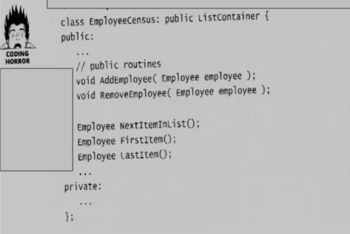

# Material 02 - Inheritance

### Lab 01

求下列 JAVA 程式的執行結果。

```java
public class A {

   public static void main(String[] args) {
       C c = new C();
       c.foo();
       c.bar();
   }

   public void foo() {
       System.out.println("foo from A");
   }

   public void bar() {
       System.out.println("bar from A");
   }
}

class B extends A {
   @Override
   public void foo() {
       System.out.println("foo from B");
   }
}

class C extends B {
   @Override
   public void bar() {
       System.out.println("bar from C");
   }
}
```

**My Ans:**

```shell
foo from B
bar from C
```

**Explanation:**

- `C c = new C();` creates a new instance of class `C`.
- `c.foo();` calls the `foo` method. Since `C` extends `B` and `B` overrides the `foo` method from `A`, `"foo from B"` is printed.
- `c.bar();` calls the `bar` method. Since `C` overrides the `bar` method from `A`, `"bar from C"` is printed.

### Lab 02


Fix the following program, and make it OO.

```java
import java.util.ArrayList;

public class EmployeeCensus extends ArrayList<Employee> {
   public void addEmployee(Employee employee) {
       add(employee);
   }

   public void removeEmployee(Employee employee) {
       remove(employee);
   }
}

class Employee {
   // not important
}
```

**My Ans:**

```java
import java.util.ArrayList;

public class EmployeeCensus {

    private ArrayList<Employee> employees;

    public EmployeeCensus() {
        employees = new ArrayList<Employee>();
    }
    
    public void addEmployee(Employee employee) {
        employees.add(employee);
    }

    public void removeEmployee(Employee employee) {
        employees.remove(employee);
    }
}

class Employee {
    // not important
}
```

**Explanation:**
不要去繼承 `ArrayList`，而是使用 `ArrayList` 作為 `EmployeeCensus` 的一個成員變數。

### Lab 03

求下列 JAVA 程式的執行結果。

```java
public class X {
    public static void main(String[] args) {
        X x = new X();
        Y y = new Y();
        x.doSomething();
        y.doSomething();
    }

    public void doSomething() {
        this.print();
    }

    public void print() {
        System.out.println("XXX");
    }
}

class Y extends X {
    @Override
    public void print() {
        System.out.println("YYY");
    }
}
```


**My Ans:**

```shell
XXX
YYY
```

**Explanation:**

1. 首先建立一個 `X` 的物件 `x` 和 `Y` 的物件 `y`。
2. 接著呼叫 `x` 的 `doSomething()`，由於 `x` 是 `X` 的物件，所以呼叫 `X` 的 `print` 方法，印出 `XXX`。
3. 接著呼叫 `y` 的 `doSomething()`，由於 `Y` `override` 了 `X` 的 `doSomething()`，所以印出 `YYY`。

### Lab 04


The following code is Java. There are some compilation errors in the code.   
How can you fix it to pass compilation?  
You can only change the code without deleting any lines of the code. 

```java
1. class SuperMan{
2.     private int a;
3.     protected SuperMan(int a){this.a = a;}
4. }
...
11. class SubMan extends SuperMan{
12.     public SubMan(int a){super(a);}
13.     public SubMan(){this.a = 5;}
14. }
```

**My Ans:**

```java
1. class SuperMan{
2.     private int a;
3.     protected SuperMan(int a){this.a = a;}
4. }
...
11. class SubMan extends SuperMan{
12.     public SubMan(int a){super(a);}
13.     public SubMan(){super(5);}
14. }
```

### Lab 16

OK, 現在你應該知道繼承不能被濫用。你也知道以下的程式碼該怎麼改。  
不過其實一直還有一個更神秘的問題，那就是以下濫用繼承的程式碼為什麼不好，它會有什麼問題？也就是說，你可能以前繼承就是這樣寫，但是你好像也沒有發生過什麼問題不是嗎？



> [!TIP]
> (此題會深刻思考題，比重等同其他題目的3倍) 請仔細回答。

**My Ans:**


