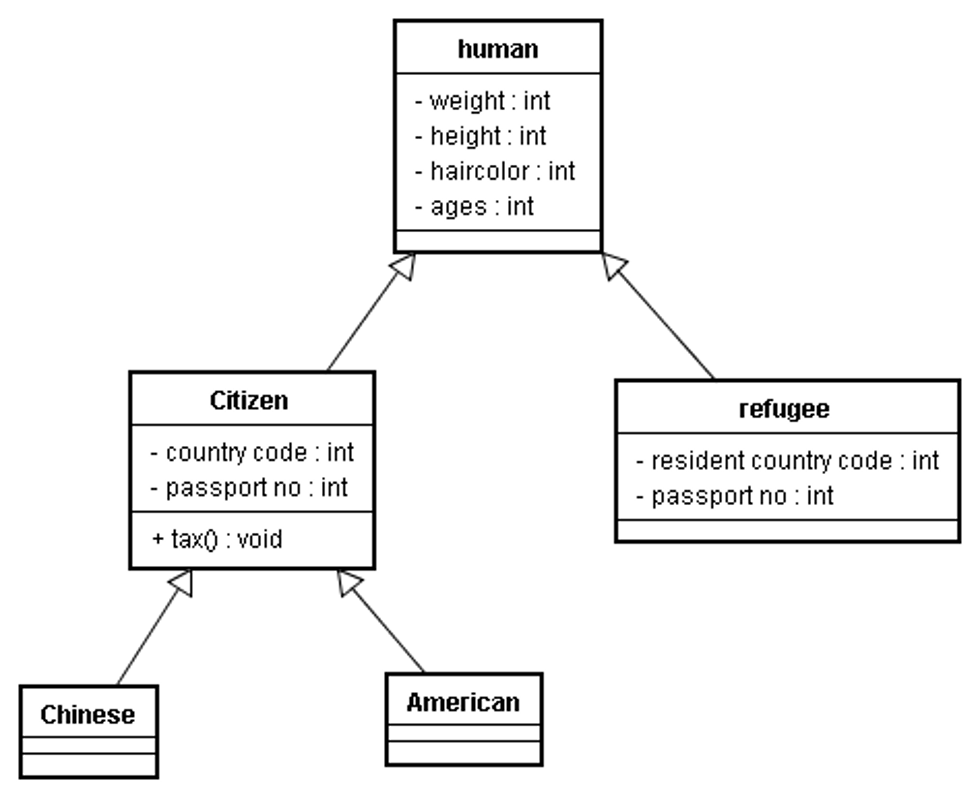

# Material 02 - Inheritance

## Course

### Lab 05

請你告訴我，對於物件導向，繼承這個機制帶來的好處和壞處。

**My Ans:**
- 好處是：可以實現特異化，並且還能保有原先特性
- 壞處是：需要很有 comman sense 以免寫出無意義的

**Prof Ans:**
- Benefits: reuse, 便利的部分可以擴充推到 subclass 如果可以結合 polymorphism 就可以更好的擴充
- Drawbacks: 用錯了程式碼會更難維護

### Lab 06

Please try to explain why a pet destructor is called to print the message on the screen?

**My Ans:**

`cat` 的 destructor，當你用一個 subclass override 掉 base class 的 method

**Prof Ans:**

`(pet)pussy (troncated)` 會強制轉，強制把 `pussy (cat)` 變成 `pet`，因此會把 `cat` 的記憶體部分切掉，


### Lab 07

Java has no member initialization list. So how can you complete the example in slide 12?

**My Ans:**

用 `super()` 並且只能在 constructor 的第一行


### Lab 11

The following code contains two classes.

```cpp
class person {
    person() ;
    person(int age, int height);
}

class student: public person {
   student(int age, int height, int studentID)   
}
```

(a) How can the subclass student pass the parameters age and height to a base class person in C++?


**My Ans:**

```cpp
student :: student(int age, int height, int studentID) : person(age, height)  {
    int _studentID = studentID;
}
```

```cpp
student :: student(int age, int height, int studentID) : person(age, height), _studentID(studentID)  {
}
```

person 會變成 argument 給 student


### Lab 08

Why constructor and destructor is not inherited? Please explain it in a short sentence.

**My Ans:**

Each subtype of the base class has its own constructor and destructor. -> copy constructors and destructors are not inherited.


### Lab 09

In principle, each subclass has its constructor.   
What is the main task of a subclass constructor? That is, what a subclass constructor should do?

**My Ans:**

因為每個 subclass 都需要建構屬於自己特異化的部分，也就是會建立自己的 memory space


### Lab 13

What is overloading?


**My Ans:**

```cpp
class XXX {
  void dosSomething(int x, string b);
  void dosSomething(int x, string b, char c);
}
```

同名的 `function` 但是 `signature` 不同，如上案例

### Lab 15

請說明繼承的基本原則是什麼?

**My Ans:**

子類別是不是服類別的群集，`Is American a Human?`，滿足並且可以沿用做特異化


### Lab 18

以下的兩個 subclass 投影片告訴你沒有意義. 請你進一步釐清為何沒有意義? 你可以舉例子嗎?



**My Ans:**

如果 American, Chinese 沒有跟 Citizen 做出其他的特徵，那就直接用 Human 就好了

如果真的要用，可以加上 American 公民與一般 Citizen 不同的內容，像是健保等等，做出特異化才有必要


---

## Take Home

### Lab 01

求下列 JAVA 程式的執行結果。

```java
public class A {

   public static void main(String[] args) {
       C c = new C();
       c.foo();
       c.bar();
   }

   public void foo() {
       System.out.println("foo from A");
   }

   public void bar() {
       System.out.println("bar from A");
   }
}

class B extends A {
   @Override
   public void foo() {
       System.out.println("foo from B");
   }
}

class C extends B {
   @Override
   public void bar() {
       System.out.println("bar from C");
   }
}
```

**My Ans:**

```shell
foo from B
bar from C
```

**Explanation:**

- `C c = new C();` creates a new instance of class `C`.
- `c.foo();` calls the `foo` method. Since `C` extends `B` and `B` overrides the `foo` method from `A`, `"foo from B"` is printed.
- `c.bar();` calls the `bar` method. Since `C` overrides the `bar` method from `A`, `"bar from C"` is printed.

### Lab 02


Fix the following program, and make it OO.

```java
import java.util.ArrayList;

public class EmployeeCensus extends ArrayList<Employee> {
   public void addEmployee(Employee employee) {
       add(employee);
   }

   public void removeEmployee(Employee employee) {
       remove(employee);
   }
}

class Employee {
   // not important
}
```

**My Ans:**

```java
import java.util.ArrayList;

public class EmployeeCensus {

    private ArrayList<Employee> employees;

    public EmployeeCensus() {
        employees = new ArrayList<Employee>();
    }
    
    public void addEmployee(Employee employee) {
        employees.add(employee);
    }

    public void removeEmployee(Employee employee) {
        employees.remove(employee);
    }
}

class Employee {
    // not important
}
```

**Explanation:**
不要去繼承 `ArrayList`，而是使用 `ArrayList` 作為 `EmployeeCensus` 的一個成員變數。

### Lab 03

求下列 JAVA 程式的執行結果。

```java
public class X {
    public static void main(String[] args) {
        X x = new X();
        Y y = new Y();
        x.doSomething();
        y.doSomething();
    }

    public void doSomething() {
        this.print();
    }

    public void print() {
        System.out.println("XXX");
    }
}

class Y extends X {
    @Override
    public void print() {
        System.out.println("YYY");
    }
}
```


**My Ans:**

```shell
XXX
YYY
```

**Explanation:**

1. 首先建立一個 `X` 的物件 `x` 和 `Y` 的物件 `y`。
2. 接著呼叫 `x` 的 `doSomething()`，由於 `x` 是 `X` 的物件，所以呼叫 `X` 的 `print` 方法，印出 `XXX`。
3. 接著呼叫 `y` 的 `doSomething()`，由於 `Y` `override` 了 `X` 的 `doSomething()`，所以印出 `YYY`。

### Lab 04


The following code is Java. There are some compilation errors in the code.   
How can you fix it to pass compilation?  
You can only change the code without deleting any lines of the code. 

```java
1. class SuperMan{
2.     private int a;
3.     protected SuperMan(int a){this.a = a;}
4. }
...
11. class SubMan extends SuperMan{
12.     public SubMan(int a){super(a);}
13.     public SubMan(){this.a = 5;}
14. }
```

**My Ans:**

```java
1. class SuperMan{
2.     private int a;
3.     protected SuperMan(int a){this.a = a;}
4. }
...
11. class SubMan extends SuperMan{
12.     public SubMan(int a){super(a);}
13.     public SubMan(){super(5);}
14. }
```

### Lab 16

OK, 現在你應該知道繼承不能被濫用。你也知道以下的程式碼該怎麼改。  
不過其實一直還有一個更神秘的問題，那就是以下濫用繼承的程式碼為什麼不好，它會有什麼問題？也就是說，你可能以前繼承就是這樣寫，但是你好像也沒有發生過什麼問題不是嗎？


> [!TIP]
> (此題會深刻思考題，比重等同其他題目的3倍) 請仔細回答。

**My Ans:**

如老師的影片說明，當我們今天比喻嚴重一點，當 ListContainer 變成我們今天 C++ 的 library ，而我們在物件導向中是完全允許的，但是當我們今天把原本的 library 繼承過來了！代表原本的功能會被我們給改寫的，也就是實現我們繼承最重要的特異化。

那就是 base class 的 memory 會無意被我們操作到。

在上述的案例中，我們其實可以就把 ListContainer 變成 EmployeeCensus 裡的成員就好，如此我們不需要動到 base class 的 memory，也可以達到原本需要的功能實現，避免繼承的濫用！


