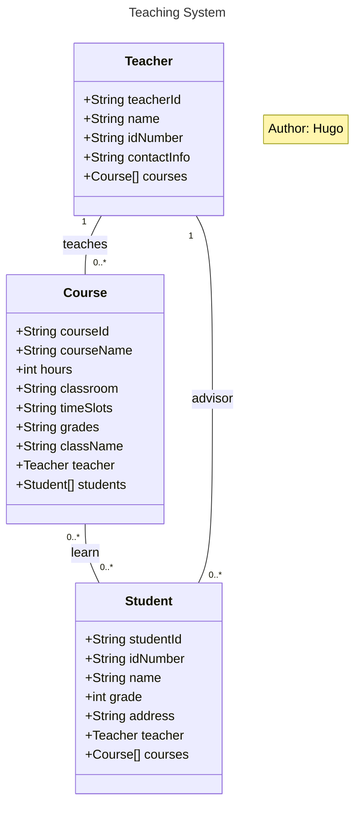

# Material 08 Lab - Data Oriented Model <!-- omit in toc -->

## Table of Contents <!-- omit in toc -->
- [Course](#course)
  - [Lab 01](#lab-01)
  - [Lab 02](#lab-02)
  - [Lab 03](#lab-03)
  - [Lab 04](#lab-04)
  - [Lab 05](#lab-05)
  - [Lab 06](#lab-06)
  - [Lab 08](#lab-08)
- [Take Home](#take-home)
  - [Homework - Lab 07](#homework---lab-07)
  - [Homework - Lab 09](#homework---lab-09)
    - [By ChatGPT](#by-chatgpt)

## Course 

### Lab 01

1. 物件導向的 class   
  等同於database 的 _______________  
  等同於ERD 的 _________________  
2. 物件導向的 object  
  等同於 database 的 ______________  
  等同於 ERD 的 __________________  

> **My Answer**
> 1. Record
> 2. Entity

### Lab 02

Ada 是一個美國軍方設計的程式語言，想要用來解決軟體工程問題。寫Ada 的程式，你必須要把程式分成兩塊。請問這兩塊跟C++的類比是?

> **My Answer**
> 
> `.cpp` 叫做實作的部分跟 `.h` 叫做宣告的部分

### Lab 03

人類第一個物件導向語言的開發單位是?

> **My Answer**
> 
> 矽谷加州的 Simula smalltalk

### Lab 04

軟體工程與程式語言(PL)的專家走了許多 procedure-oriented 的冤枉路。最後回過頭發現 database 的人早就發現的東西。這個東西是?

> **My Answer**
> 
> 正規化，以資料為中心才是重點

### Lab 05

我在影片中說，如果你真正要我信服你懂物件導向，你要說的一兩句話是什麼?

> **My Answer**
> 
> 把資料搞對、辨識出系統未來需要的擴充，開始建立一些 class diagram 去預測未來需要的擴充透過繼承多型去做成 subclass

### Lab 06

所謂的 association 是一個 ____詞。它通常是database table 之間的 ______key

> **My Answer**
>
> 1. 動
> 2. foreign


### Lab 08

Methodology (方法論) 是什麼東西? 為什麼我們需要它

> **My Answer**
> 
> 我們需要個可以通用設計的要素。以做一件事情，每個人來做差異都很大的話叫做沒有方法，因此各個領域都有所謂的方法論，可能可以做到八九不離十，甚至其他人來做也會差不多

## Take Home

### Homework - Lab 07

以下的程式有什麼問題？你要怎麼修改？

```cpp
class product {
  int pno ;
  
  vector<customer *> customers ;
}

class customer {
  int cno ;
  string name ;
  vector<product *> products ;
```

Product 以及 Customer 的元素是互相指向對方的，以題目給定的程式碼來看，商品的欄位需要存取客戶的資料，同時客戶的欄位也需要存取商品的資料。

```cpp
class Product {
  int pno ;
}
```

```cpp
class Customer {
  int cno ;
  string name ;
}
```

```cpp
class Relation {
  product *p ;
  customer *c ;
}
```

### Homework - Lab 09

請針對投影片最後一頁的問題進行分析，然後請以 UML 作答 (以舊的ERD diagram 作答 一律 0 分)

你現在是一個系統分析師,你的任務是分析一個校務行政系統.請畫出此系統的UML 圖, 以下是概略的需求分析

- 一個老師可以敎許多門課
- 每一個學生可以自行選修課來修
- 目前的開授的科目有英文, 數學, 物理, 化學, 國文.
- 每一個開課的科目包含授課時數, 授課教室, 授課時段, 授課年級與班級以及授課老師等資訊.
- 學生的學籍包含身分證號碼, 學號, 年級, 姓名, 住址
- 每個學生都會被編到一個班級上課, 由一位老師擔任導師

You are a system analyst and you are responsible for analyze an e-school system. Please draw UML diagram for the following requirement 

- A teacher can teach many courses
- A student can enroll in several courses
- The course subject include Chinese, English, Math, Chemistry
- A course has hours, classroom, time slots, grades, class, teacher
- A student has ID, name, grade, address
- Each student will be assigned to a class. There is one teacher will be assigned to the class as an advisor.

> [!TIP]
> Do you need to make subject into a table?
> 
> - If for a hundred year, your subject name change little, a table can be skipped. A string field can be used in the course table. But somehow your program need to maintain a list of these subjects (strings) as well.
> - However, if you have additional attributes needed to be added to a subject. Such as course description, course textbook, etc. Making it into a table is a better solution.
>
> What if don't normalize?
> 
> You may write
> ```cpp
> Class student {
>    int sid ;
>    vector<course*> my_courses;
> }
> 
> Class  course {
>    int cid ;
>    vector<students*> students ;
> }
> ```
> 
> What’s wrong?
> 
> 如果上級長官有要求，要求你紀錄每個學生修課時的到課時數 (註:任何新的屬性與兩者都相關)


- The course subject include Chinese, English, Math, Chemistry
```cpp
class Teacher {
    string teacherId;
    string name;
    string idNumber;
    string contactInfo;
    Course[] courses = ["Math", "English", "Chinese", "Chemistry"]
}
```

A course has hours, classroom, time slots, grades, class, teacher

```cpp
class Course {
    string courseId;
    string name;
    string hours;
    string classroom;
    string[] timeSlots;
    string grades;
    string className;
    Teacher teacher;

    Student[] students;
}
```

A student has ID, name, grade, address

```cpp
class Student {
    string studentId;
    string name;
    string idNumber;
    string address;
    string grade;
}
```



#### By ChatGPT

Prompts: 請針對投影片最後一頁的問題進行分析，然後請以 UML 作答 (以舊的ERD diagram 作答 一律 0 分)

你現在是一個系統分析師,你的任務是分析一個校務行政系統.請畫出此系統的UML 圖, 以下是概略的需求分析

- 一個老師可以敎許多門課
- 每一個學生可以自行選修課來修
- 目前的開授的科目有英文, 數學, 物理, 化學, 國文.
- 每一個開課的科目包含授課時數, 授課教室, 授課時段, 授課年級與班級以及授課老師等資訊.
- 學生的學籍包含身分證號碼, 學號, 年級, 姓名, 住址
- 每個學生都會被編到一個班級上課, 由一位老師擔任導師

> [!TIP]
> Do you need to make subject into a table?
> 
> - If for a hundred year, your subject name change little, a table can be skipped. A string field can be used in the course table. But somehow your program need to maintain a list of these subjects (strings) as well.
> - However, if you have additional attributes needed to be added to a subject. Such as course description, course textbook, etc. Making it into a table is a better solution.
>
> What if don't normalize?
> 
> You may write
> ```cpp
> Class student {
>    int sid ;
>    vector<course*> my_courses;
> }
> 
> Class  course {
>    int cid ;
>    vector<students*> students ;
> }
> ```
> 
> What’s wrong?
> 
> 如果上級長官有要求，要求你紀錄每個學生修課時的到課時數 (註:任何新的屬性與兩者都相關)

根據給定的需求分析，以下是校務行政系統的UML類別圖：

**UML 類別圖**

```plaintext
+-----------------------------------------+
|                  老師                   |
+-----------------------------------------+
| - 教師編號: String                      |
| - 姓名: String                          |
| - 身分證號碼: String                    |
| - 聯絡方式: String                      |
+-----------------------------------------+
| * 教授的課程: Set<課程>                 |
+-----------------------------------------+
                |
                |
                |
                1
+---------------|-------------------------+
|                  課程                   |
+-----------------------------------------+
| - 課程編號: String                      |
| - 課程名稱: String                      |
| - 授課時數: int                         |
| - 授課教室: String                      |
| - 授課時段: String                      |
| - 授課年級與班級: String                |
| - 授課老師: 老師                        |
+-----------------------------------------+
| * 修課學生: Set<學生>                   |
+-----------------------------------------+
                |
                |
                |
                *
+---------------|-------------------------+
|                  學生                   |
+-----------------------------------------+
| - 學號: String                          |
| - 身分證號碼: String                    |
| - 姓名: String                          |
| - 年級: int                             |
| - 班級: String                          |
| - 住址: String                          |
| - 導師: 老師                            |
+-----------------------------------------+
| * 修讀課程: Set<課程>                   |
+-----------------------------------------+

```

**類別圖說明**

1. **老師 (Teacher)**
   - 教師編號 (ID)
   - 姓名 (Name)
   - 身分證號碼 (Identity Number)
   - 聯絡方式 (Contact Information)
   - 教授的課程 (Set of Courses)

2. **課程 (Course)**
   - 課程編號 (Course ID)
   - 課程名稱 (Course Name)
   - 授課時數 (Teaching Hours)
   - 授課教室 (Classroom)
   - 授課時段 (Schedule)
   - 授課年級與班級 (Grade and Class)
   - 授課老師 (Teacher)
   - 修課學生 (Set of Students)

3. **學生 (Student)**
   - 學號 (Student ID)
   - 身分證號碼 (Identity Number)
   - 姓名 (Name)
   - 年級 (Grade)
   - 班級 (Class)
   - 住址 (Address)
   - 導師 (Advisor/Teacher)
   - 修讀課程 (Set of Courses)

**分析**

1. **老師與課程的關係**
   - 一個老師可以教授多門課程 (1 對 多)。

2. **學生與課程的關係**
   - 一個學生可以修讀多門課程 (多 對 多)。
   - 課程中也會有多個學生修讀，因此在課程中需要有一個學生的集合 (Set of Students)。

3. **學生與班級的關係**
   - 每個學生被分配到一個班級 (每個學生只有一個班級)。
   - 每個班級有一位導師 (老師)。

4. **課程的屬性**
   - 每門課程包含授課時數、授課教室、授課時段、授課年級與班級以及授課老師等信息。

**補充說明**

- **課程的設計**
  - 根據需求，課程名稱 (如: 英文、數學、物理、化學、國文) 可以直接使用字符串來表示，如果未來可能會增加描述或教材等屬性，則可以考慮將其設計為獨立的表 (類別)。

這樣的UML類別圖能夠有效地描述校務行政系統的主要結構和關係，滿足需求分析中的各項要求。