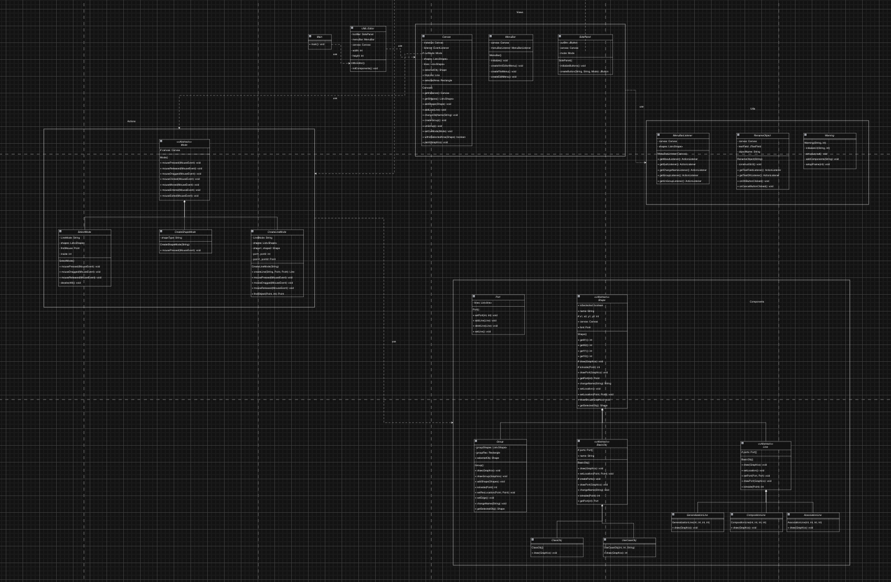
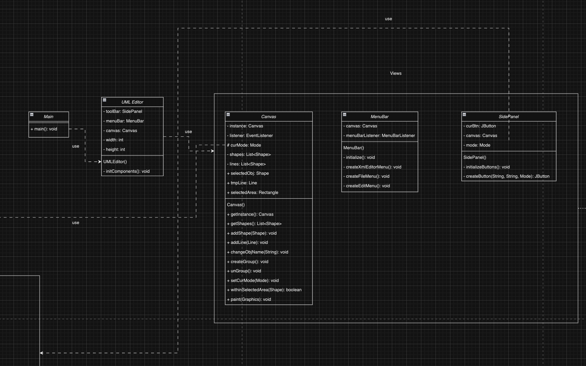
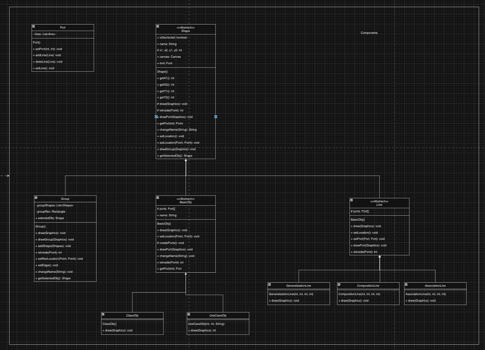
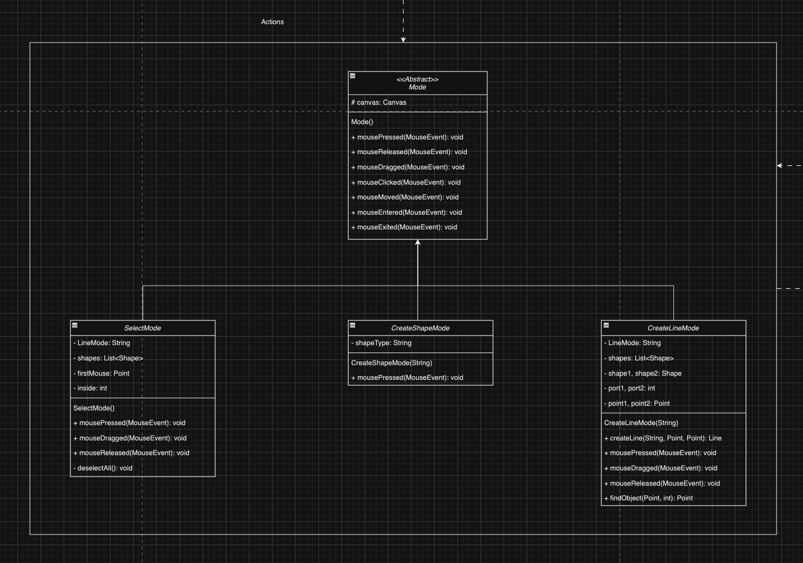
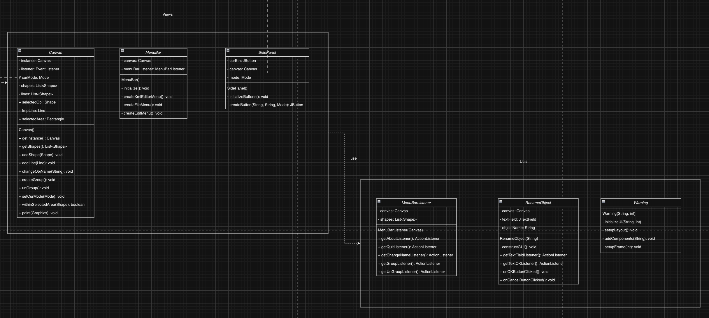

# Material 12 Lab - UML Class Diagram <!-- omit in toc -->

## Take Home

### Homework - Lab 11

你手上已經有了期中 project 的 UML editor 規格書。請分析這個規格書中的所有 terms，然後畫出 class diagram。(此題分數有 20 倍加權)

可以使用任何工具繪製。

#### Terms

`Components`
- `Component/Canvas.java`
- `Component/MenuBar.java`
- `Component/SidePanel.java`

`Listener`
- `Listener/MenuBarListener.java`

`Modes`
- `Mode/CreateLineMode.java`
- `Mode/CreateShapeMode.java`
- `Mode/Mode.java`
- `Mode/SelectMode.java`

`Shapes`
- `Shape/AssociationLine.java`
- `Shape/BasicObj.java`
- `Shape/ClassObj.java`
- `Shape/CompositionLine.java`
- `Shape/GeneralizationLine.java`
- `Shape/Group.java`
- `Shape/Line.java`
- `Shape/Port.java`
- `Shape/Shape.java`
- `Shape/UseCaseObj.java`

`Utils`
- `Utils/RenameObject.java`
- `Utils/Warning.java`

`Views`
- `View/UMLEditor.java`

`Main.java`

#### Class Diagram

Whole class diagram:

Views:

Components:

Actions:

Utils:

#### Discussion

1. 畫完全部的流程圖後，真的如助教當時所說的，有些繼承的關係是可以再精進的，尤其是我在畫 components 的時候，components 之間的關係很細分，但是沒有好好使用到多型，很多 class 都根據基底 class 要多宣告一次記憶體，我覺得這可以修正。
2. 在 Views 區塊有大量區域都要宣告 canvas 以及 Action 都需要使用到 canvas 的初始，也就是有太多功能依賴著 canvas 或許我可以把他拉出來變成獨立的 Action 去控制，不然就失去封裝的意義。
3. 我有很多 class 的 variable 一下宣告 public, 一下宣告 protected 但是在 subclass 我又宣告一次，這樣等於沒有善用繼承的結果，是可以修正的。 

#### Reference

- [簡單理解 UML 類別圖](https://misomiso43.medium.com/%E7%B0%A1%E5%96%AE%E7%90%86%E8%A7%A3-uml-%E9%A1%9E%E5%88%A5%E5%9C%96-f0b32a3272c)
- [UML Class Diagram Tutorial](https://www.visual-paradigm.com/guide/uml-unified-modeling-language/uml-class-diagram-tutorial/)
