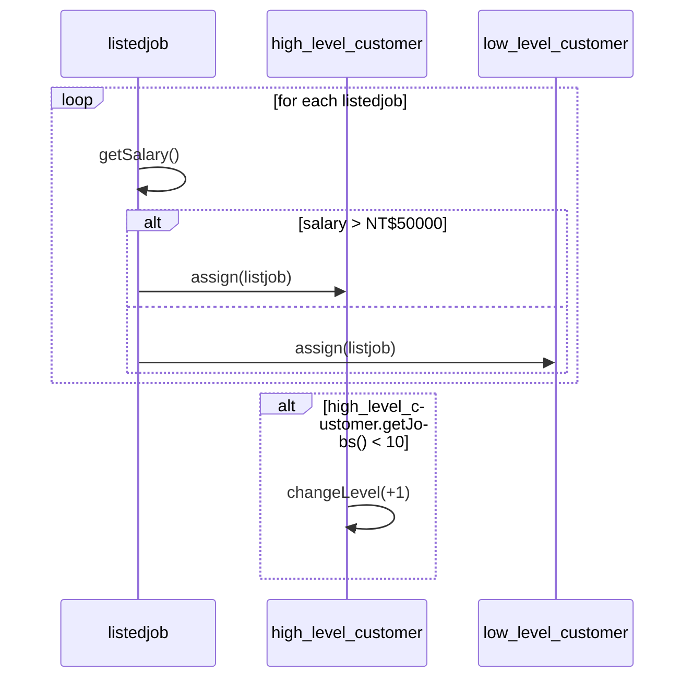

# Material 13 Lab - UML Sequence Diagram <!-- omit in toc -->

## Course

### Lab 01

找尋物件的方法可以區分成兩大類。請問是哪兩大類。

> **My Answer:**
> 
> Maximize, minimize

### lab 02

CRC Cards 的方法基本上是屬於哪一種方法?

> **My Answer:**
>
> CRC Cards 全名是 Class-Responsibility-Collaborator Cards，是一種物件導向分析方法。透過 use-cases 去分析的方法。

### Lab 03

請問在 sequence diagram 中 以下兩個箭頭有什麼不同


1. 
2. 同步用


### Lab 04


an Order, and Order Line, aProduct, aCustomer

calculate price

```cpp
calculatePrice() {

}

getPrice(quantity: number) {

}

getDiscountValue() {
    return discountValue;
}

getBaseValue()
```

### lab 05

The following is a pseudo code for 104 Job-hunting website. 

  procedure searchjob
    foreach (listedjob)
       if (listjob.getSalary() > NT$50000)
            high_level_customer.assign(listjob)
       else
            low_level_customer.assign(listjob)
    end for
    if (high_level_customer.getJobs() < 10)
        high_level_customer.changeLevel(+1);
  end procedure

Please draw the UML sequence diagram (diagram版本請至少是UML 2.0或以上)




- [[UML]學習筆記-循序圖型(Sequence Diagrams)-8](https://terryjryeh.blogspot.com/2019/03/uml-sequence-diagrams-8.html)
