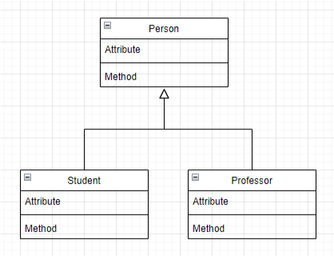
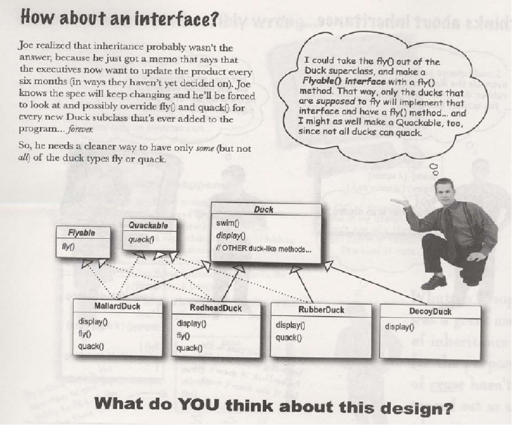
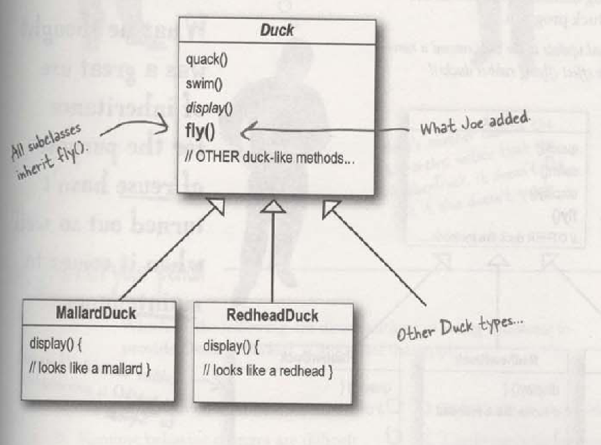
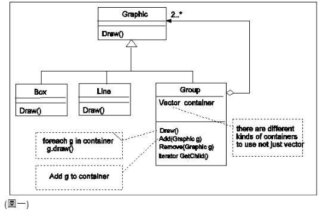
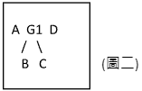

# Material 14 Lab - Design Pattern 1 <!-- omit in toc -->

## Course

### Lab 01

對於 design pattern 造成的新問題，請寫出其中 2 種批判即可

> **My Answer:**
> 
> 1. Taget 錯誤的問題
> 2. 帶領問題的沒有效率的解法

### Lab 02

Design pattern 通常是為了增進程式碼的彈性而引入 additional level of indirection。這樣子的結果通常會傷害 _______________


> **My Answer:**
>
> 導致設計變得複雜並且導致原有效能受損

### Lab 03

你很聰明對某個東西又很執著，通常可以用一個英文字 _________ 來形容你。

> **My Answer:**
>
> Geek

### Lab 04

某個學生進入我的實驗室看到以下的程式片段覺得不符合物件導向程式碼的許多準則。請問你的處理步驟是?

```cpp
if (type == "wop") {
    assert(false);
    xp.type = T_WOP;
    xp.wop_nodetype = this;
    xp.val_wop = _wop;
} else if (type == "varname") {
    xp.type = T_STRING;
    xp.val_string = wop->getName();
} else if (type == "int*") {
    xp.type = TP_INT;
    WOP_Int_Proxy *iwop = dynamic_cast<WOP_Int_Proxy *>(wop);
    assert(iwop != NULL);
    xp.val_int_ptr = iwop->getIntValAddr();
    // xp.original = _wop->getVal();
} else if (type == "int") {
    xp.type = T_INT;
    WOP_Int_Proxy *iwop = dynamic_cast<WOP_Int_Proxy *>(wop);
    assert(iwop != NULL);
}
```

> **My Answer:**
>
> 1. 首先要探討這段程式在未來到底會不會需要擴充
> 2. 如果需要看要用什麼方式去改進
> 3. 如果不用其時就維持就好

### Lab 06

請舉兩個原因說明為何 global variable 是邪惡的。

> **My Answer:**
>
> 1. 任何地方任何人都可以取用，因此在哪裡會被莫名被更改內容
> 2. 成上，會造成看這一區塊的程式碼，我們不知道這邊的變數到底是做什麼的。

### Lab 07

```java
class GLOBAL {
static X ux ;
static void init() {
    ux = new X();
}

// Somewhere in main() or in any class use the following.
GLOBAL.ux.dosomething();
```

請問 global 這個 class 在物件導向的分類中叫做 ______________class

> **My Answer:**
>
> Singleton

### Lab 08

繼續前一個例子。
```java
class GLOBAL {
static X ux ;
static void init() {
    ux = new X();
}

// Somewhere in main() or in any class use the following.
GLOBAL.ux.dosomething();
```

用這樣子的方法來解決單一物件的問題有何缺點? (講一種就好)

> **My Answer:**
>
> 一定要有人呼叫 init 才會 init 記憶體，可能會造要使用的時候，記憶體並沒有配置好

### Lab 09

你深知 girl friend 只能有一個，你想把它寫成 singleton。請填空

```java
public class GirlFriend {
    _____________ GirlFriend mylove ;
    _____________ GirlFriend() { }
    Public _________ GirlFriend getInstance() {
        If (mylove == null) {
          mylove = new GirlFriend();
        }
        Return mylove ;
}
```

> **My Answer:**
>
> 1. `private`
> 2. `private`
> 3. `static`
> 
> ```java
> public class GirlFriend {
>     private static GirlFriend myLove;
>     private GirlFriend() { }
>     public static GirlFriend getInstance() {
>         if (myLove == null) {
>             myLove = new GirlFriend();
>         }
>         return myLove;
>     }
> }
> ```

### Lab 10

有個學生他寫出了以下的繼承架構。然後他的核心程式碼不斷地出現

```cpp
Student *s = new Student() ;
For each student s 
    s.Method();
```

請問他違反了什麼原則？



> **My Answer:**
>
> 他沒有用到 polymorphism，因為基底 `Person` 才是 Core。

### Lab 12

在鴨子的螢幕保護遊戲中，這位 Joe 老兄丟出了這樣的繼承架構。請問這繼承架構實做下去有何問題?



> **My Answer:**
>
> 會造成很多的 copy and paste 要把哪些需要 quack 或是 fly 的鴨子都要特別去 implement Quackable, Flyable。

### Lab 13

請解釋 program to interface, not implementation。 (你可以用例子說明)

> **My Answer:**
>
> 就比如動物會有叫聲，但是貓跟狗的叫聲其實不一樣，因此我們，不過他們都是會叫的，因此我們可以有個 interface 可以當成動物的 Base Class 去讓其他動物延續特異化。

我們可以用 composition 的方式去設計，未必每一個都要用 polymorphism？

### Lab 14

一開始這位 Joe 老兄為了讓鴨子能夠飛，把他加入 super class 裡面。請問這犯了什麼問題?



> **My Answer:**
>
> 這樣會讓那些不會飛的鴨子也被迫要一起有飛的記憶體。

## Take Home

### Homework - Lab5

當你為 UML editor 增加一個 Group 的物件並且把其行為 (methods) 逐漸地加進去。如圖一。 其中 `add()`, `remove()`, `GetChild()` 都是 Group 的特異化行為。所以只存在於 Group 物件。



假設我們在 Canvas 用了一個 vector AllObjectList 來存放所有在編輯區的物件
另外假設目前有 A, B, C, D 四個物件。

1. 一開始四個物件平行的存放於 AllObjectList 如圖二 A B C D
2. 假設 物件 B，C 如今被 group 成 Group 物件
3. 我們會先建立一個 group 物件 G1 
4. 將 B，C 從 AllObjectList 移除
5. 呼叫 `G.add(B)`, `G.add(C)`
6. 最後再把物件 G 加入到 `AllObjectList` 中

最後的狀態如圖二



所有落在 B，C 的 mouse 事件，改由 G1 接收，B, C `draw()` 的功能也改由 G1 去進行呼叫。到目前為止好像沒有問題，一切圓滿。

但是問題來了，譬如你們的 umleditor usecase D.2 要去 ungroup 一個物件。假設使用者事先點選了某一個物件，然後到 Edit Menu 選擇 ungroup 的功能。若被點選的物件記錄在 selected 這個變數，這時候你不得不寫下下面的一段 code

```java
MENU_EDITactionperformed() {
    if (selected instanceof Group)
        // 我們要把 selected 的所有 child 物件移除，再加入 AllObjectList
        for all child c in selected.getChild()
            selected.remove(c);
            add c to AllObjectList;
            delete selected
    } else {
        // do nohing
    }
}
```

也就是說，我們必須先判斷 selected 是否是 Group 物件，如果是，我們才能呼叫 group 物件所特有的 `getChild()`, `remove()` ... 等等呼叫

這樣必須要去區分是否為 group object 的例子也會出現在其他地方。當出現的地方一多的時候會對 programmer 開始造成困擾。Programmer 不能專心的乾淨的解決一件事情，往往還要擔心如果物件型別不一樣的時候，要做什麼特殊的處理。

請問解決的方法是？

> **My Answer:**
> 
> **首先先分析目前會遇到的問題：**
> 1. 如果要 ungroup 的時候，我們必須要先判斷是否為 Group 物件，才能去呼叫 Group 物件的特異化 method。
> 2. 當今天物件很多的時候，我們需要去檢查每一個物件是否為 Group 物件，這樣會造成程式碼的複雜度增加。
> 
> 所以我們希望能夠達成今天要 ungroup 的時候，不需要去判斷是否為 Group 物件，就能夠直接呼叫 `getChild()`, `remove()` ... 等等呼叫。
> 
> **Solutions:**
> 
> 可以加一個 interface `Groupable` 去判斷 Line, Box ... 元件是否為 `isGroup()`，如此我們不需要特別去判斷是否為 Group 物件，我們可以直接呼叫 `getChild()`, `remove()` ... 等等呼叫。
> 
> ```java
> interface Groupable {
>     boolean isGroup();
>     void getChild();
>     void remove();
> }
> ```
