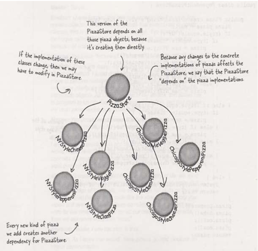
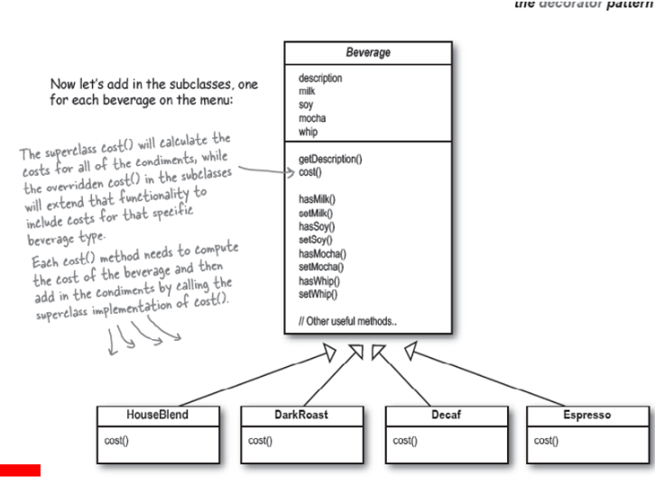
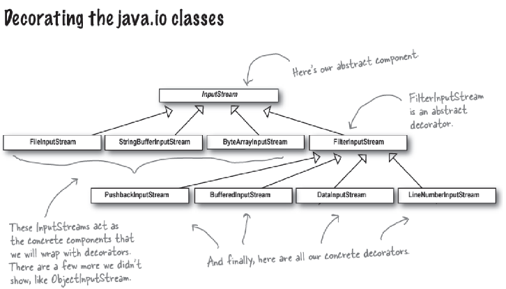

# Material 15 Lab - Design Pattern 2 <!-- omit in toc -->


## Course

### Lab 02

```cpp
HondaCivic mycar = new HondaCivic() ;
```

請問這一段程式碼如果出現在 high-level component (核心程式碼)違反了什麼 principle

> **My Answer:**
>
> Dependency Inversion Principle [System Design: Dependency Inversion Principle]

[System Design: Dependency Inversion Principle]: https://www.baeldung.com/cs/dip

### Lab 03

請把下列程式的 dependency relation (graph) 畫出來。

```java
Pizza orderPizza(String type) {
    Pizza pizza;

    if (type.equals("cheese")) {
        pizza = new CheesePizza();
    } else if (type.equals("greek")) {
        pizza = new GreekPizza();
    } else if (type.equals("pepperoni")) {
        pizza = new PepperoniPizza();
    } 

    pizza.prepare();
    pizza.bake();
    pizza.cut();
    pizza.box();

    return pizza;
}
```

> **My Answer:**
> 
> ```mermaid
> classDiagram
>     class Pizza {
>         +prepare()
>         +bake()
>         +cut()
>         +box()
>         +orderPizza()
>     }
> 
>     class CheesePizza {
>         +prepare()
>         +bake()
>         +cut()
>         +box()
>     }
> 
>     class GreekPizza {
>         +prepare()
>         +bake()
>         +cut()
>         +box()
>     }
> 
>     class PepperoniPizza {
>         +prepare()
>         +bake()
>         +cut()
>         +box()
>     }
> 
>     Pizza <|-- CheesePizza
>     Pizza <|-- GreekPizza
>     Pizza <|-- PepperoniPizza
> 
> ```

### Lab 04

請問什麼是 Dependency Inversion Principle?

> **My Answer:**
>
> 透過 abstract 去實現，而不是具體的，我們不會直接拿 component 加諸到我們的系統之上，而是透過 abstract 的階層關係去實現。

interfaces or abstract functions and classes rather than upon concrete functions and classes. ?

### Lab 05

請示範如何用 Dependency Inversion Principle 反轉 lab3 的 dependency?

(請使用 pizza store 的例子寫 pseudo code即可。)



> **My Answer:**
> 
> ```java
> interface Pizza {
>     void prepare();
>     void bake();
>     void cut();
>     void box();
> }
> ```
> 
> CheesePizza, GreekPizza, PepperoniPizza 去接 Pizza
> 
> 有個 PizzaFactory 的接口，去讓 Pizza 製作，最後有個 PizzaStore 去提供點餐。

**By ChatGPT:**

要應用依賴倒置原則（Dependency Inversion Principle, DIP），我們需要使高層模組（如 `PizzaStore`）不再依賴於低層模組（如具體的 `CheesePizza`、`GreekPizza` 等類別），而是依賴於抽象（例如接口或抽象類別）。這樣一來，我們可以更容易地更換具體的 `Pizza` 實現，而不需要修改高層模組的代碼。

以下是一個示範如何用依賴倒置原則來重構你的 `orderPizza` 方法的 pseudo code：

1. 定義一個 `Pizza` 抽象類別或接口。
2. 每個具體的 `Pizza` 類別實現該抽象類別或接口。
3. 定義一個 `PizzaFactory` 抽象類別或接口，用於創建 `Pizza` 對象。
4. 高層模組（如 `PizzaStore`）依賴於 `PizzaFactory` 來創建 `Pizza` 對象。

以下是重構後的 pseudo code：

```java
// Step 1: Define a Pizza interface
interface Pizza {
    void prepare();
    void bake();
    void cut();
    void box();
}

// Step 2: Implement concrete Pizza classes
class CheesePizza implements Pizza {
    public void prepare() { /* Implementation */ }
    public void bake() { /* Implementation */ }
    public void cut() { /* Implementation */ }
    public void box() { /* Implementation */ }
}

class GreekPizza implements Pizza {
    public void prepare() { /* Implementation */ }
    public void bake() { /* Implementation */ }
    public void cut() { /* Implementation */ }
    public void box() { /* Implementation */ }
}

class PepperoniPizza implements Pizza {
    public void prepare() { /* Implementation */ }
    public void bake() { /* Implementation */ }
    public void cut() { /* Implementation */ }
    public void box() { /* Implementation */ }
}

// Step 3: Define a PizzaFactory interface
interface PizzaFactory {
    Pizza createPizza(String type);
}

// Step 4: Implement the factory
class SimplePizzaFactory implements PizzaFactory {
    public Pizza createPizza(String type) {
        Pizza pizza = null;

        if (type.equals("cheese")) {
            pizza = new CheesePizza();
        } else if (type.equals("greek")) {
            pizza = new GreekPizza();
        } else if (type.equals("pepperoni")) {
            pizza = new PepperoniPizza();
        }

        return pizza;
    }
}

// Step 5: Modify the PizzaStore to use the PizzaFactory
class PizzaStore {
    private PizzaFactory factory;

    public PizzaStore(PizzaFactory factory) {
        this.factory = factory;
    }

    public Pizza orderPizza(String type) {
        Pizza pizza = factory.createPizza(type);

        if (pizza != null) {
            pizza.prepare();
            pizza.bake();
            pizza.cut();
            pizza.box();
        }

        return pizza;
    }
}

// Usage example
PizzaFactory factory = new SimplePizzaFactory();
PizzaStore store = new PizzaStore(factory);
Pizza pizza = store.orderPizza("cheese");
```

在這個重構後的設計中，`PizzaStore` 不再直接依賴於具體的 `Pizza` 類別，而是依賴於 `PizzaFactory`。這樣，如果我們想要添加新的 `Pizza` 類別或更改 `Pizza` 的創建邏輯，只需修改或擴展 `PizzaFactory` 的實現，而不需要修改 `PizzaStore` 的代碼。這符合依賴倒置原則，使系統更加靈活和可維護。

### Lab 06

在 starbuzz coffee 的例子中，下圖是其中的一個過渡的設計。請問這個設計有什麼問題?



> **My Answer:**
>
> 有個問題就是當我們今天要加上 Milk, Foam 等等的時候，我們都要去使用 DarkRose, HouseBlend... 等等的 `cost()`

### Lab 08

Class should be open for extension but closed for modification。

請用中文解釋這個 design principle 的意思 (請勿直接翻譯)

> **My Answer:**
>
> 在不動到 core 設計的同時，能夠保有給 subclass 的運用接口，但是有不能被更動到的設計。

### Lab 10

Decorator pattern 基本上讓你可以把額外的行為疊加在物件上。不過基本上繼承也可以。但是他們最大的差別是?

> **My Answer:**
>
> Decorator 可以用組合的方式，去把「特定需求」功能給疊加上去，但是原本的繼承是所有的內容都必須給疊加，如此 Decorator 可以更靈活地且動態的去新增我們要的行為。

### Lab 11 (?)

下圖是 java.io classes。 假設我想建立一個 input stream 從檔案讀入，但是讀出來的時候可以有 line number 的資訊。請問我應該如何使用 java.io?



> **My Answer:**
>
> 在 LineNumberInputStream 的時候 new FileInputStream, new BufferedInputStream 在我們讀檔以及內容的時候去把行號加上

### Lab 12

請說明 Model View Control (MVC) Pattern 要解決什麼問題?

> **My Answer:**
>
> 讓 GUI 的地方不要去實作功能，把點擊介面的操作放到 Controller 至於該內容需要執行的功能放到 Model 去實作！

## Take Home

### Homework - Lab15

想像一下，如果你 "硬是" 要將你的 UML editor 改成 MVC。請問一下你的 model 應該長成什麼樣子? 請寫個 class template, 幾個代表性的 API 就好。

> **My Answer:**
> 
> View 所有在畫面上顯示的內容都放到 View 裡面，Controller 用來處理點擊事件，Model 用來處理所有的邏輯。並且 Controller 會再把 Model 處理完的結果再傳回 View。
> 
> 會需要 Graphic 來處理所有的 Graphic，同時會定義 AssociationLine, CompositionLine, GeneralizationLine, Class, UseCase 等等的物件以達成點選畫面的按鈕在畫面上畫出相對應的物件。
> 
> ```java
> class Graphic {
>     Line drawLine(Line line);
>     Object drawObject(Object obj);
> 
>     void group();
>     void ungroup();
>     void rename();
> }
> ```
