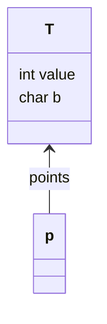

# Material 01.5 Pointer, Reference<!-- omit from toc --> 

## Table of Contents<!-- omit from toc -->
- [Deference in `C`](#deference-in-c)
- [How pointer and dereference are implemented](#how-pointer-and-dereference-are-implemented)
- [(WRONG )How to swap two variables in C? (pass by VALUE)](#wrong-how-to-swap-two-variables-in-c-pass-by-value)
- [How to swap two variables in C? (pass by REFERENCE)](#how-to-swap-two-variables-in-c-pass-by-reference)
- [How to swap two variables in C++? (pass by REFERENCE)](#how-to-swap-two-variables-in-c-pass-by-reference-1)
  - [object](#object)
- [Java's pass by REFERENCE](#javas-pass-by-reference)
- [C++'s pass by REFERENCE](#cs-pass-by-reference)
- [(PRACTICE) How to swap two variables in pass by REFERENCE in Java?](#practice-how-to-swap-two-variables-in-pass-by-reference-in-java)

```c
char b;
char *p;

p = &b;     // p points to the address of b

print p;    // print the address of b
print *p;   // print the value of b (this is called dereferencing)
```

## Deference in `C`

```c
struct X {
    int value;
    char b;
};

X m;
X *p;

(*p).value;
p->value; // same as above
```

`p` 本來就放個門牌，麻煩 CPU 拿著這個門牌再走幾步去把 value 拿出來。

<div align="right">
    <p>
        <a href="#table-of-contents" target="_blank"><b>☝🏼 [Back to TOC]</b></a> 
    </p>
</div>

## How pointer and dereference are implemented

inderect addressing mode

```asm
.data
bVal BYTE 10

mov esi, bVal         ;  ESI = 10 
mov esi, OFFSET bVal  ;  ESI = 00404000h  address of bVal 
mov esi, [esi]        ; ESI = 10 ;  load from bVal
```

<div align="right">
    <p>
        <a href="#table-of-contents" target="_blank"><b>☝🏼 [Back to TOC]</b></a> 
    </p>
</div>

## (WRONG )How to swap two variables in C? (pass by VALUE)

```c
main() {
    char x = 10;
    char y = 5;

    swap(x, y);
    print x; // stil 10
    print y; // still 5
}

// pass by value
void swap(char a, char b) {
    char temp;
    temp = a;
    a = b;
    b = temp;
}
```

in user system stack, it looks like this:
```
+--------+ <- Final Pointer of Stack, then clear the stack, back to start place
|    t   |
+--------+
| b = 5  |  (SWAP Here, but didn't change the original x, y)
+--------+
| a = 10 |
+--------+ <- Strat Pointer of Stack
```

Therefore the problem is that the `swap` function is not changing the original `x` and `y` in the `main` function.

<div align="right">
    <p>
        <a href="#table-of-contents" target="_blank"><b>☝🏼 [Back to TOC]</b></a> 
    </p>
</div>

## How to swap two variables in C? (pass by REFERENCE)

```c
main() {
    char x = 10;
    char y = 5;

    swap(&x, &y);
    print x; // 5
    print y; // 10
}

// pass by reference
void swap(char *a, char *b) {
    char temp;
    temp = (*a);
    (*a) = *b;
    (*b) = temp;
}
```

<div align="right">
    <p>
        <a href="#table-of-contents" target="_blank"><b>☝🏼 [Back to TOC]</b></a> 
    </p>
</div>

## How to swap two variables in C++? (pass by REFERENCE)

```cpp
main() {
    char x = 10;
    char y = 5;

    swap(x, y);
    print x; // 5
    print y; // 10
}

void swap(char &a, char &b) {
    char temp;
    temp = a;
    a = b;
    b = temp;
}
```

### object

```cpp
main() {
    A x = 10;
    A y = 5;

    A &p; // compiler will not allow this

    swap(x, y);
    print x; // 5
    print y; // 10
}

void swap(A &a, A &b) {
    char temp;
    temp = a.value;
    a.value = b.value;
    b.value = temp;
}
```

```cpp
main() {
    A x = 10;
    A y = 5;

    swap(&x, &y);
    print x; // 5
    print y; // 10
}

void swap(A *a, A *b) {
    char temp;
    temp = a->value;
    a->value = b->value;
    b->value = temp;
}
```

<div align="right">
    <p>
        <a href="#table-of-contents" target="_blank"><b>☝🏼 [Back to TOC]</b></a> 
    </p>
</div>

## Java's pass by REFERENCE

```java
class T {
    int value;
    char b;
}

T p; // create a reference variable (pointer)

p = new T(); // p points to the address of T
```

in memory, it looks like this:



<div align="right">
    <p>
        <a href="#table-of-contents" target="_blank"><b>☝🏼 [Back to TOC]</b></a> 
    </p>
</div>

## C++'s pass by REFERENCE

```cpp
class T {
    int value;
    char b;
}

T p;        // create a T-type variable of size(T), there is no pointer or reference
T *q;

q = new T(); // q points to the address of T
```

in C++, no matter the origin type or the pointer type, it is always mentioning the creation of a variable.

```cpp
char p;
int p;
long p;
T p;
```

in Java, it is always mentioning the creation of a reference.

```java
char p;
dosomething(p); // pass by value

T p;            // create T reference variable (pointer)
p = new T();
dosomething(p); // pass by reference
```

<div align="right">
    <p>
        <a href="#table-of-contents" target="_blank"><b>☝🏼 [Back to TOC]</b></a> 
    </p>
</div>

## (PRACTICE) How to swap two variables in pass by REFERENCE in Java?

```java
class T {
    int value;
    char b;
}

main() {
    T x = new T();
    T y = new T();

    swap(x, y);
    print x.value; // 5
    print y.value; // 10
}

void swap(T a, T b) {
    int temp;
    temp = a.value;
    a.value = b.value;
    b.value = temp;
}
```

<div align="right">
    <p>
        <a href="#table-of-contents" target="_blank"><b>☝🏼 [Back to TOC]</b></a> 
    </p>
</div>
