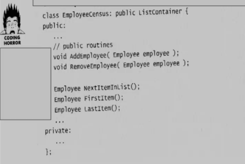

# Material 02.6 - Why You Should Not Abuse Inheritance Over Composition  <!-- omit from toc --> 

**Table of Contents**
- [Lab 16](#lab-16)
- [Inheritance vs Composition](#inheritance-vs-composition)
  - [Inheritance](#inheritance)
  - [Composition](#composition)
- [Bad 1 - We can override ALL!!!](#bad-1---we-can-override-all)
- [Bad 2, Polymorphism Freedom can kick your ASS](#bad-2-polymorphism-freedom-can-kick-your-ass)
- [Example of bad Inheritance \[^1\]](#example-of-bad-inheritance-1)

## Lab 16

OK, 現在你應該知道繼承不能被濫用。你也知道以下的程式碼該怎麼改。  
不過其實一直還有一個更神秘的問題，那就是以下濫用繼承的程式碼為什麼不好，它會有什麼問題？也就是說，你可能以前繼承就是這樣寫，但是你好像也沒有發生過什麼問題不是嗎？



> [!TIP]
> (此題會深刻思考題，比重等同其他題目的3倍) 請仔細回答。


## Inheritance vs Composition

### Inheritance

```cpp
class EmployeeCensus : public vector {

    // public routine
    void addEmployee(Employee employee);
    void removeEmployee(Employee employee);

    Employee NextItemList();
    Employee FirstItem();
    Employee LastItem();
}
```

### Composition

```cpp
class EmployeeCensus {

    // employeecensus number data

    vector Employees;

    // public routine
    void addEmployee(Employee employee);
    void removeEmployee(Employee employee);

    Employee NextItemList();
    Employee FirstItem() {
        return employees.front();
    }
    Employee LastItem();
}
```


## Bad 1 - We can override ALL!!!

For example `vector` has the following methods:

```
member function
|-- vector::assign
|-- vector::at
|-- vector::back
...
```

- What if some stupid subclass overrides front carelessly?

By the way, I can override ANY of the methods inherited from vector, such as `clear()` to wipe out all the contents of the vector.

> [!CAUTION]
> A class only carry the methods needed !!


## Bad 2, Polymorphism Freedom can kick your ASS

```cpp
Vector *v = new EmployeeCensus(); 
```

> [!CAUTION]
> ## This is allowed !! And why do you want to do that?


> [!IMPORTANT]
> ## 一個 class 只會攜帶他是和操作、本身可以操作、應該操作的行為

## Example of bad Inheritance [^1]

```cpp
class myGreatTransmitterTCP : tcp {
    void send(string d) { 
      // done by TCP
    }
    void doSomething1(......);
    void doSomething2(......);
}

// If still more protocol
class myGreatTransmitterRS232 : RS232 {
    void send(string d) { 
      // done by RS232
    }
    void doSomething1(......);
    void doSomething2(......);
}

class myGreatTransmitterUSB : USB {
    void send(string d) { 
      // done by USB
    }
    void doSomething1(......);
    void doSomething2(......);
}
```

> [!CAUTION]
> The above phenomanon is abused Inheritance -> `Copy-Paste Programming
> `

```cpp
class myReallyGreatTransmitter {
    protocol m;
    myReallyGreatTransmitter(protocol m);
}

myGreatTransmitterTCP = new myReallyGreatTransmitter(new tcp);
myGreatTransmitterRS232 = new myReallyGreatTransmitter(new rs232);
myGreatTransmitterUSB = new myReallyGreatTransmitter(new USB);
```

[^1]: [Subclass/inherit standard containers?](https://stackoverflow.com/questions/6806173/subclass-inherit-standard-containers)

