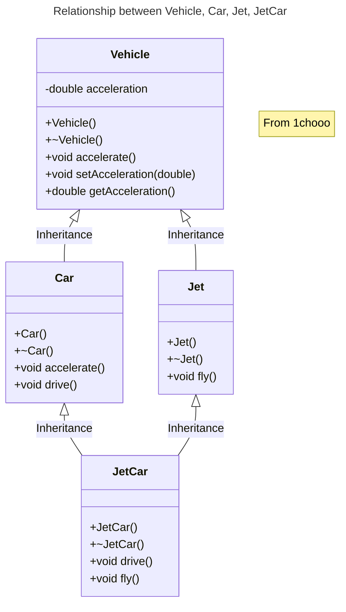

# Material 04 - Multiple Inheritance

**Table of Contents**
- [Material 04 - Multiple Inheritance](#material-04---multiple-inheritance)
  - [Introduction](#introduction)
  - [Percolating Up](#percolating-up)
  - [A smarter solution?](#a-smarter-solution)
    - [In Java](#in-java)
  - [Casting in C/C++](#casting-in-cc)
    - [Outputs](#outputs)
  - [Analysis of the Ambiguity](#analysis-of-the-ambiguity)


> [!IMPORTANT]
> Polymorphism 與未來擴充的型別無關

## Introduction

```cpp
#include <iostream>

using namespace std;

class Vehicle {
  public:
    Vehicle() { cout << "Vehicle Constructor" << endl; }
    virtual ~Vehicle() { cout << "Vehicle Destructor" << endl; }
    virtual void accelerate() const { cout << "Vehicle Accelerating" << endl; }
    void setAcceleration(double a) { acceleration = a; }
    double getAcceleration() const { return acceleration; }

  private:
    double acceleration;
};

class Car : public Vehicle {
  public:
    Car() { cout << "Car Constructor" << endl; }
    virtual ~Car() { cout << "Car Destructor" << endl; }
    virtual void accelerate() const { cout << "Car Accelerating" << endl; }
    void drive() const { cout << "Car Driving" << endl; }

  private:
    // Car inherits acceleration accessors, member
};

int main() {
    Car myCar;
    myCar.setAcceleration(9.81); // One "G"
    cout << "Accelerating at " << myCar.getAcceleration() << " m/(s*s)";
    cout << endl;

    myCar.accelerate();
    myCar.drive();
}
```


> [!NOTE]
> - `accelerate()` is declared as `virtual` -> can be overridden. -> it is automatically `virtual` in all subclasses.
> - If using the keyword **`virtual`** in Car -> learer that `accelerate()` is a `virtual` method. -> Another programmer, looking only at the Car class, would know that the method was `virtual`.
> `setAcceleration()` and `getAcceleration()`, are non `virtual`. -> don't expect to override them in any subclasses, but rather just inherit them. Notice that the `Car` class has indeed inherited these methods.


```cpp
class JetCar : public Car {
    public:
        JetCar() {}
        virtual ~JetCar() {}
        virtual void drive() const { cout << "JetCar driving" << endl; }
        virtual void fly() const { cout << "JetCar flying" << endl; }
    };
}

/*
-----------------------
some function elsewhere
-----------------------
*/

void analyzePerformance(Car *testVehicle) {
    testVehicle->drive();
    testVehicle->fly();
}
```

- the `drive()` method of `JetCar` override the the `drive()` of car because the driving method of jetcar should be a little different from car
- because `JetCar` can fly, so a new method called `fly()` is added and is prepared to be overridden

> [!WARNING]
> There is an error in compilation in `analyzePerformance` 
> 
> -> car does not have a fly method only JetCar does

```bash
drive.cpp:44:18: error: no member named 'fly' in 'Car'
    testVehicle->fly();
    ~~~~~~~~~~~  ^
1 error generated.
```

## Percolating Up

```cpp
class Car : public Vehicle {
  public:
    Car() {}
    virtual ~Car() {}
    virtual void accelerate() const { cout << "Car Accelerating" << endl; }
    virtual void drive() const { cout << "Car Driving" << endl; }
    virtual void fly() const { cout << "Cars can only fall" << endl; }

  private:
    // Car inherits acceleration accessors, member
};

class JetCar : public Car {
  public:
    JetCar() {}
    virtual ~JetCar() {}
    virtual void drive() const { cout << "JetCar driving" << endl; }
    virtual void fly() const { cout << "JetCar flying" << endl; }
};

int main() {
    Car myCar;
    JetCar myJetCar;
    analyzePerformance(&myCar);
    analyzePerformance(&myJetCar);
    return 0;
}
```

We get the correct result.

- The Car class has a "fly" method. Surely, Cars don't fly. We added the fly method to Car so that a base class pointer could be used on either. This is known as **percolating upward**. 
- The fly method was moved up into a base class, but the base class Car should not have that functionality. 
- If we percolated up more methods as we built these classes, Car becomes **bloated and confused**. Generally, only functionality common to all subclasses belongs in a base class.

## A smarter solution?

```cpp
class Car : public Vehicle {
  public:
    Car() {}
    virtual ~Car() {}
    virtual void accelerate() const { cout << "Car Accelerating" << endl; }
    virtual void drive() const { cout << "Car Driving" << endl; }

  private:
    // Car inherits acceleration accessors, member
};
class JetCar : public Car {
  public:
    JetCar() {}
    virtual ~JetCar() {}
    virtual void drive() const { cout << "JetCar driving" << endl; }
    virtual void fly() const { cout << "JetCar flying" << endl; }
    // 如果我們要加上 SubmarineCar，我們無法做到萬年不動，除了要加一個新的 class 還要找到這裡修改，我們應該要做到「跟未來擴充的型別無關」
};

void analyzePerformance(Car *testVehicle) {
    JetCar *ptr;
    // A pointer of subclass type, JetCar
    testVehicle->drive();
    // drive() exists for both base and sub class
    ptr = dynamic_cast<JetCar *>(testVehicle);      // cast down to JetCar pointer
    if (ptr) {
        ptr->fly();
    } else {
        cout << "Car being tested" << endl;
    }
}

int main() {
    Car myCar;
    JetCar myJetCar;
    analyzePerformance(&myCar);
    analyzePerformance(&myJetCar);
    return 0;
}
```

- C++ has a built in mechanism for **Runtime Type Identification, RTTI**. This means that as a program is running it is possible to determine the exact type of object a pointer or reference refers to. 
- RTTI is achieved in C++ via the `dynamic_cast` operator, the `typeid` operator and the `type_info` class. 
- The `dynamic_cast` operator returns a pointer to type `JetCar` if have the address of a `JetCar` object in the original pointer, `testVehicle`. Otherwise, the `dynamic_cast` operator returns `NULL`. 
- Dynamic casting used in this manner is referred to as "casting down". We have casted a base class pointer down its hierarchy into a subclass pointer. 

> [!NOTE]
> Casting up: `Car *p = (Car *) new JetCar();`

### In Java

In Java you can use `instanceof`

For example:
```java
analyzePerformace (Car testvehicle) {
    if (testvehicle instanceof JetCar) {
        ...
    }
```

> [!WARNING]
> That is BAD!!!
>
> - Explicitly checking an objects type is usually indicative of bad design  
> - Generally, you should avoid explicitly testing the type of an object in your code. 
> - Why? As told in **spaghetti code course**. As additional classes are formed, every point in the code that makes explicit checks on object type may need modification. If you forget to modify code somewhere, you may not find out until your program fails and your JetCar careens off into the sun. For practice, consider what modifications would be needed to support my next project, the BoatCar.

## Casting in C/C++

```cpp
ptr = dynamic_cast <JetCar *>(testVehicle); // Dynamic Cast
ptr = static_cast <JetCar *>(testVehicle); // Static Cast 
ptr = (JetCar *) testVehicle; // C style static cast
```

> [!IMPORTANT]
> In Visual C++, RTTI is not turned on by default, if you run this code without turning on RTTI, you will get a **cryptic error message saying something like "'dynamic_cast' used on polymorphic type 'Car' with /GR-; unpredictable behavior may result".** Turning on RTTI allows the compiler to insert additional code to support RTTI as it forms object files. 


```cpp
#include <iostream>

using namespace std;

class Vehicle {
  public:
    Vehicle() { cout << "Vehicle Constructor" << endl; }
    virtual ~Vehicle() { cout << "Vehicle Destructor" << endl; }
    virtual void accelerate() const { cout << "Vehicle Accelerating" << endl; }
    void setAcceleration(double a) { acceleration = a; }
    double getAcceleration() const { return acceleration; }

  protected:
    double acceleration;
};

class Car : public Vehicle {
  public:
    Car() { cout << "Car Constructor" << endl; }
    virtual ~Car() { cout << "Car Destructor" << endl; }
    virtual void accelerate() const { cout << "Car Accelerating" << endl; }
    virtual void drive() const { cout << "Car Driving" << endl; }

  private:
    // Car inherits acceleration accessors, member
};
class Jet : public Vehicle {
  public:
    Jet() { cout << "Jet Constructor" << endl; }
    virtual ~Jet() { cout << "Jet Destructor" << endl; }
    virtual void fly() const { cout << "Jet flying" << endl; }
};

class JetCar : public Car, public Jet {
  public:
    JetCar() { cout << "JetCar Constructor" << endl; }
    virtual ~JetCar() { cout << "JetCar Destructor" << endl; }
    virtual void drive() const { cout << "JetCar driving" << endl; }
    virtual void fly() const { cout << "JetCar flying" << endl; }
};
void analyzeCarPerformance(Car *testVehicle) {
    testVehicle->drive();
    // drive() exists for both base and sub class
}
void analyzeJetPerformance(Jet *testVehicle) {
    testVehicle->fly();
    // fly() exists for both base and sub class
}

int main() {
    Car myCar;
    Jet myJet;
    JetCar myJetCar;

    cout << endl;
    cout << "Car testing in progress" << endl;
    analyzeCarPerformance(&myCar);
    analyzeCarPerformance(&myJetCar);
    cout << "Jet testing in progress" << endl;
    analyzeJetPerformance(&myJet);
    analyzeJetPerformance(&myJetCar);
    cout << endl;

    return 0;
}
```

### Outputs

- `myCar` Constructor
  ```
  Vehicle Constructor
  Car Constructor
  ```

- `myJet` Constructor
  ```
  Vehicle Constructor
  Jet Constructor
  ```

- `myJetCar` Constructor
  ```
  Vehicle Constructor
  Car Constructor
  Vehicle Constructor
  Jet Constructor
  JetCar Constructor
  ```

- `myJetCar` Destructor
  ```
  JetCar Destructor
  Jet Destructor
  Vehicle Destructor
  Car Destructor
  Vehicle Destructor
  ```

- `myJet` Destructor
  ```
  Jet Destructor
  Vehicle Destructor
  ```

- `myCar` Destructor
  ```
  Car Destructor
  Vehicle Destructor
  ```



- `JetCar` inherits from both `Car` and `Jet`. 
- `JetCar` inherits two `Vehicle` parts. This means that when calling a method that is in `Vehicle`, but not overridden in the subclass `JetCar`, or when we access a variable that exists only in `Vehicle`, 

> [!IMPORTANT]
> we must explicit specify which `Vehicle` part we are accessing: we must explicit specify which `Vehicle` part we are accessing: 


with multiple inheritance a subclass is a kind of each of its base classes. `JetCar` is a `Car` and it is a `Jet`. It may be used in places that expect a `Car` object, such as `analyzeCarPerformance()`. It can also be used in places that expect a Jet, such as `analyzeJetPerformance()`. 

However, how about the ambiguity?

## Analysis of the Ambiguity

```cpp