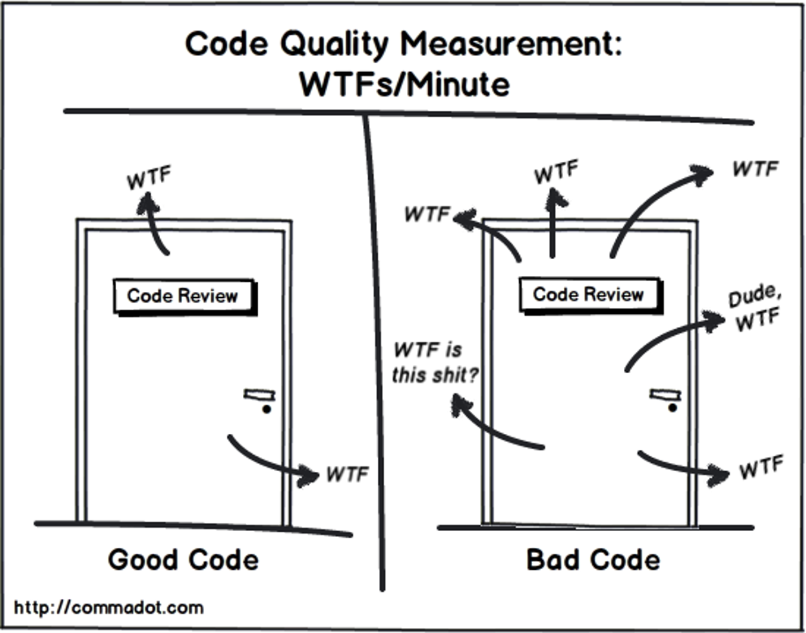

# Material 06 - Source Code Quality <!-- omit in toc -->

**Table of Content**
- [Code Review](#code-review)
- [Typical symptoms of bad code](#typical-symptoms-of-bad-code)

> Do you think code contains ART?
> 
> YES.

What is the difference between ART and Science?
- ART -- no objective criteria
- Science -- based on objective criteria 
  - Repeatable experiments
  - Describable by explicit formalism such as maths 
How do you judge a painting or art pieces?

## Code Review

Software Engineering studies show that the quality of the code between a peak performer and an mediocre programmer is an order of magniture ($10^1$) -- SACKMAN, EROKSON, and GRANT

> [!IMPORTANT]
> Another Study shows that the number of years in experience is not a key factor to peak performer and mediocre programmer.

- A process to check and examine submitted code 
- Before the integration (sometimes called code inspection)
- After the test (mostly is called code review)

## Typical symptoms of bad code

- Difficult to understand
- Difficult to change (changing at one place results in changes in many other places) 
- Hardwire the solutions (for example, instead of coming out a nice algorithms and data structures, many if is used)
- Source code is tightly coupled because the excessive use of global variables.
- Poor design that is difficult to extend.

In CS major, main focuses are problem solving such as algorithms, techniques (networking, multimedia). Writing high quality code is not encouraged or viewed as an important topic among students

We teach students how to assemble gears to solve a problem but do not educate them how to produce quality gears and measure quality of the gears.

> [!TIP] Clean and simple interface, replaceability, modularity, composablity

Their importance is not obvious in Software development, particularly if you never has chance to maintain a software

