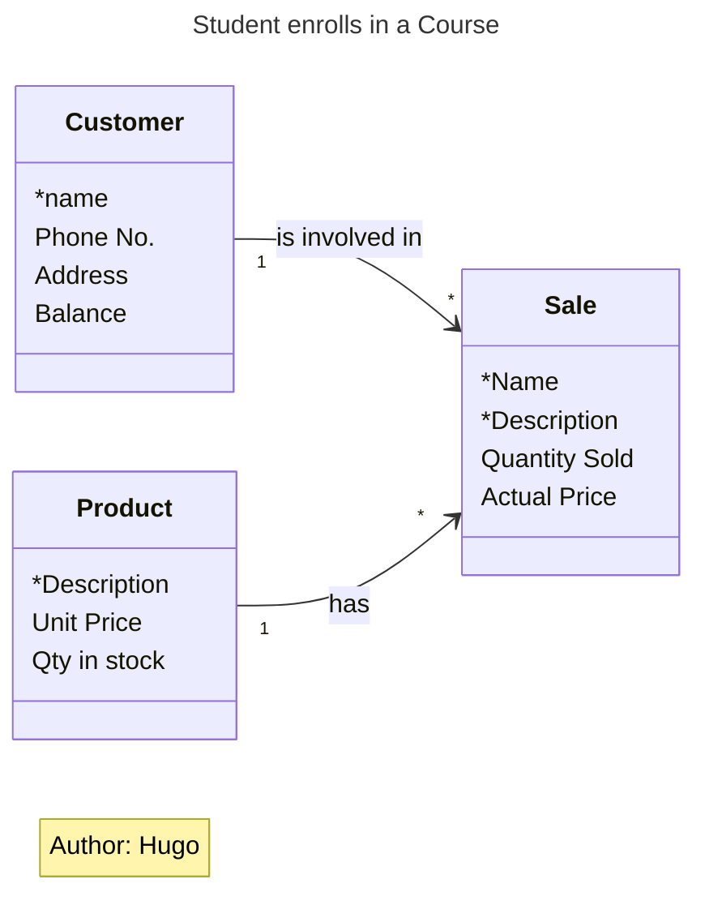

# Material 09 - How to find Classes and Objects


## Things

### Entity
An object is some Thing in the world of the user
- Car, Train, Elephant, Sale, Invoice, Division, Account, etc.
- Physical or Conceptual

It has Attributes that describe it:
- Make, Model, Year, 
- Color, Weight, 
- Serial Number, License Number

It has Relationships to other objects:
- e.g., to a Person object, i.e., the Owner.


### Object

It has Behavior that it can do:
- Create
- Change Color
- Change Owner
- Destroy Itself (Suicide?)

## Jacobson’s Three Types


### Entity Objects

things in the users' real world

- Concrete objects - Employee, Product, Tool, etc.
- Conceptual objects - Corporation, strategy, membership, approval, etc.
- Event and State objects - Purchase, delivery, arrival, ownership, status, etc.

### Interface Objects

To encapsulate the details of GUIs, communication protocols, and the like.

### Control Objects

To carry complex methods that don't have a class they obviously belong in.

## The KRB Seven-Step Method 

### 1. Candidate Classes 

Several ways to  find nouns that might turn out to be names of classes that matter to your project.

Definition: Nouns that are possible class names, being considered for inclusion in the project.

> [!NOTE]
> Just find all the names!

#### Entity Objects

1. Client Interviews
2. Nouns from the Documentation
3. Brainstorming

#### Interface Objects

1. User Interfaces: Your classes will be defined by your GUI tool.
2. Data Communications Interfaces: 
   - If you buy a communications class library, your classes are already defined for you.
   - The published communications protocol should be filed with or referred from your project documentation.
3. Real-world systems to control or monitor:
    - Industrial Processes, etc.
    - Define a single-instance class to represent the external system.

#### Control classes

Will mostly be discovered in the Design Phase of the OODLC.

- As with anything else, if the topic arises earlier during the Analysis Phase,
- Use you judgement;
- Either do it now, or
- Make serious notes to ensure it gets done later. (Don't ever miss it!)


### 2. Define Classes

Here we check for the meaning the users attach to each noun, and decide whether it is important for this project.

Each Candidate Class must undergo three checks:

#### 1. A Real-World Identifier

> [!TIP]
> "How do I tell one . . . from another?"

Objects have Identity, so they are distinct from each other, and there is usually some way to tell them apart.

How do we tell one Student from another?

- Different names - won't do, not unique.
- Also, names and such are too sensitive to errors
    - Punctuation and case
    - Spelling and spacing 
- Different faces - scanning technology not yet good enough

Some Examples of Identifiers:

Student No., Customer No., Account No., Licence No., Serial No., Product Code, Category Code, Vendor ID, Employee No., Building ID, Street Name, City Name, State/Province ID, Vehicle ID  No. (VIN), Inventory No., Room No., Legal Description (Land), Policy No.

- So we try to find a unique identifier for our Candidate Class.
- If we can’t, then it’s definitely not a class.
- If we eventually do find one, then we move on to the next test,

Question 2: The Definition . . .


#### 2. A Definition

> [!TIP]
> "What is a . . . ?"

#### 3. Sample Attributes and Behaviors

> [!TIP]
> "What might I need to know about a . . .?"
> 
> or "What can happen to a . . .?"


### 3. Establish Associations

Checking how these things interact gives us a picture of the pathways that exist throughout the data

Here we ask the questions:
- "What does a Student **DO** to a Course?" 
    **Enrolls in** it, of course.
- "What does a Customer **DO** to a Product?"
    A Customer **buys** a Product.
- "What does a Teacher **DO** to a Course?"
    A Teacher **teaches** a Course.

> [!NOTE]
> An association is an interaction between instances of two classes, represented by a verb.
> The ones we want are those that describe things that happen in the users' business.
> We need a sentence that goes 
> 
> **"Object verb Object"**
> 
> And makes sense in the users' world.

The Verb, and The Multiplicity !!! $C_{2}^{n}$

### 4. Expand Many-to-Many Associations

An essential step that generates much discussion and more classes.

> [!TIP]
> Check the strings - the `M:M` is now 2 x `1:M` !!




### 5. Attributes

We list out all the data fields the users need to keep about each thing (i.e., about each type of entity).


### 6. Normalization

A technical consideration, with a different relevance in the object paradigm.  This step is done behind closed doors without the users.


### 7. Operations (i.e., Behavior)

This is the additional step that distinguishes objects from entities and earlier models. This part is the subject of Chapters 10 and 11.

Six techniques for Finding Operations
1. By Inspection
2. Basic CRUD
3. Use Cases
4. Statechart Diagram
5. CRC Cards
6. CRUD Revisited

### 8. 

1. Find the similarity (in behaviors) and construct  inheritance hierarchy
2. Make sure there are association linked to base classes (a.k.a polymorphism) 


## Problem A


### 需求.1

- 你是一個幫百視達(電影DVD租片商)進行電腦化的工程師。以下是你要處理的規格
- 百視達的片子分三種: 新片($3)，舊片($2)，與兒童片($2)
- 一部電影有當然有很多片子可以承租
- 每一種片子有不同的計價。
  - 新片$3 可以租一天，每多一天，一天是$2
  - 舊片$2 可以租三天，每多一天，一天是$1
  - 兒童片$2 可以租5天，每多一天，一天是$1
- 每一種片子有不同的積點優惠來做為鼓勵常常光顧客戶的措施
  - 新片每租一片，常客基點 2.0，
  - 舊片每租一片，常客基點 1.0
  - 兒童片常客積點 0.5

### 需求.2

- 百視達常常會要求印出某一個客戶的報表(print statement)，這個報表需要印出
  - 過去曾經租過的片子，所有租片的總消費金額 (請記得，一個客戶會租各種片子)
  - 計算常客積點總數

### 請分析之後寫出problem A

- Class 宣告
  - Class 名稱
  - 關鍵 attributes (member) 與常數
- 每個 Class 的關鍵 method (*)
  - Method 的名稱
  - Pseudo code 
- 關鍵的 method print_statement()
  - 這個method 應該屬於哪一個 class
  - 其 pseudo code 應該如何用到其他的class 的關鍵 method (你在* 分析出來的)
- main()
  - 請展示如何使用你的class 來建立一些物件
  - 例如，如果一個客戶要租一隻片，要如何使用你的class 來建立物件與必要的關聯
  - 例如，如果客戶要求列印一個客戶報表，要如何呼叫你提供的服務

### 你要繳交的範例.1

```cpp
class A {
  string name ;
  ...
  getPrice() {..}
};
class B {
  ...
  ...
  void print_statement()  {
       for each movie a in B
           total +=  a.getPrice() ;
       print "過去租片總額="+total
   }
}
```

> [!IMPORTANT]
>
> 只是個範例，你當然不能用沒有意義的名字來命名你的 class，`print_statement` 也只是個還差很遠的範例。詳細的 `print_statement` 應該完成的規格請看前幾頁

### 你要繳交的範例.2

```cpp
main() {
     ... // 請寫下如何用你的 classes 建立
         //  2 customers April, Joe
     ... // 請寫下如何用你的 classes 建立3 部電影 
         //  分別是神力女超人(舊片) ，正義聯盟(新片)，雷神索爾3(新片)
     ... // 請寫下如何用你的 classes 以及以上建立的
         // 物件實現以下的租片事實 
         // 		1. April 租了神力女超人 3 天
         // 		2. Joe 租了神力女超人 2 天
         // 		3. April 租了正義聯盟 5 天
         // 		4. Joe 租了雷神索爾3  1 天
     ... // 請寫下如何用你的 class 
         // 印出 April 的客戶報表
         // 印出 Joe 的客戶報表
}
```
