# Material 11 - Movie Rental Example<!-- omit in toc -->

> [!IMPORTANT]
> Design 見仁見智，要看未來維護「究竟需要什麼？」不是每個 switch-case 都需要使用多型

Suppose you need to implement a movie rental system, Your movie rental system must deal with
- Three kind of movie rental 
  - New release ($3)
  - Regular ($2)
  - Children  ($2)
- A movie, of course, can have several copies
- A customer can ask for a statement

Please write down the draft classes, some primary methods in each class 
- A `main()` to show how your classes are used.

## Review [`p05.java`](./movie-p05.md)

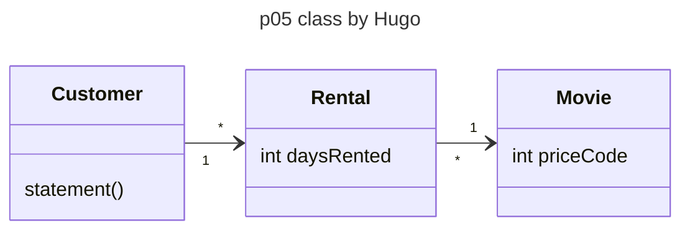


> [!NOTE]
> hard to change to deal with obvious future evolution. 

> [!IMPORTANT]
> A design is made to deal with focused future change (並非所有多型都是需要多型的，我們要看的是 Future Design 需要什麼，我們要了解未來要對付的維護需求)
>
> **未來的維護需求：**
> - 幾乎一定會發生
> - 可能會發生
> - 會發生但是可能性微乎其微

這個例子的幾個主要未來維護需求是什麼？
- 片子的種類會新增與刪減 (一定會發生)
- 片子的常客基點與常客的促銷邏輯會更改 (應該會發生)
- 片子的 `print_statement` 印出的格式會不斷地修改
- 片子的價格會改變
- 一個片子會從新片變成舊片

> [!NOTE]
> Take a look at `print_statement`
> 
> Image a future change – customer wants a new function called htmlStatement()
> 1. You will find you cannot reuse any code in p05 formally. 
> 2. Eventually, you copy-paste statement() and modify it into a new htmlStatement()
> 3. Some time in the future, you need to change the rule of computing frequent renter points
> 
> You need to change two places and maintain the consistency at two places.
> 
> 👉🏻 139 - 149 需要 copy paste

As time goes by, programmers come and go and `movie-p05` becomes chaotic, every fix can be done at once. There are too many places to fix anytime a change request is made by customer because more and more places should remain consistent
When $\text{cost}( \text{fixing} + \text{debug} + \text{testing}) > \text{cost}(\text{rework})$ it is time to rebuild, 👉🏻It is called software entropy(熵) 👉🏻 changes to a bad code is hard

> [!NOTE]
> Whe we find that we want or need to make a change, to make the chaos go away, we must invest a little effort to make it happen. But later, when we want to make another change, the effort required is near infinite. 👉🏻 The software architecture is hanging by a thread

114 - 130 會很常需要做更改 👉🏻 centralize the part of code that is subject to change in the future

## Review [`p11.java`](./movie-p11.md)

客戶本身不需要以下這段邏輯

```java
102   private double amountFor(Rental aRental) { // 計 算 一 筆 租 片 費 用 
103     double result = 0; 
104     switch (aRental.getMovie().getPriceCode()) { 
105       case Movie.REGULAR: // 普通片 
106         result += 2; 
107         if (aRental.getDaysRented() > 2) 
108           result += (aRental.getDaysRented() - 2) * 1.5; 
109         break;
110       case Movie.NEW_RELEASE: // 新片 
111         result += aRental.getDaysRented() * 3; 
112         break; 
113       case Movie.CHILDRENS: // 兒童片
114         result += 1.5; 
115         if (aRental.getDaysRented() > 3) 
116           result += (aRental.getDaysRented() - 3) * 1.5;
117         break; 
118     } 
119     return result;
120   }
121 }
```

> [!IMPORTANT]
> In most cases, a method should be on the object whose data it uses.

## Review [`p21.java`](./movie-p21.md)

- We move `amountFor()` to `Rental` class to become a method `getCharge()`
- remove temp variable `thisAmount`

不過 copy-paste 仍然在 `statement()` 裡面

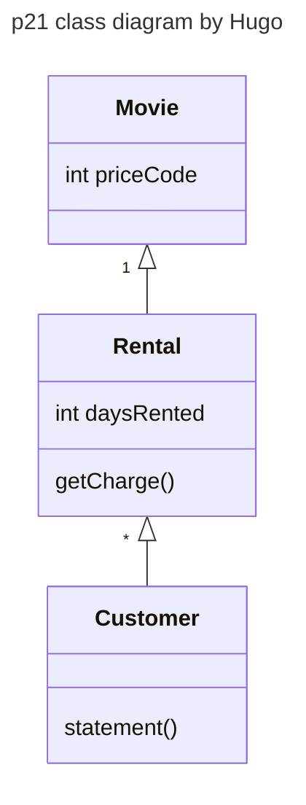

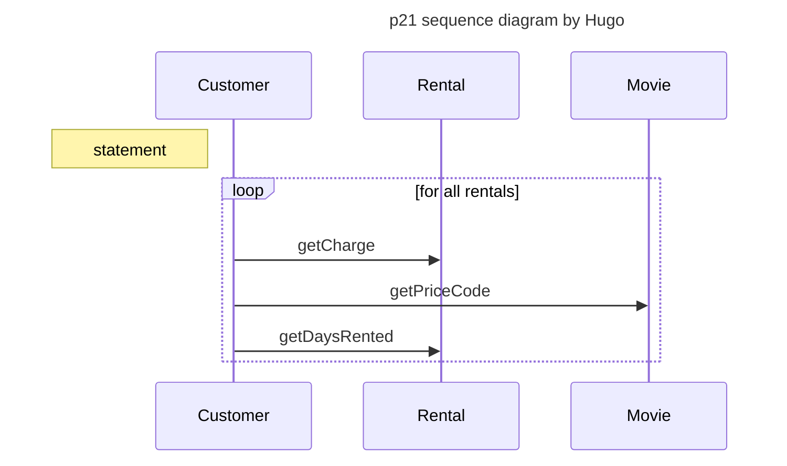

`101-106` include another part of code that is subject to change, We change it into another method of Rental class `getFrequentRenterPoints()`

## Review [`p25.java`](./movie-p25.md)

```java
73 int getFrequentRenterPoints() {
74     if ((getMovie().getPriceCode() == Movie.NEW_RELEASE) 
75         && getDaysRented() > 1)
76         return 2;
77     else
78         return 1;
79 }
```

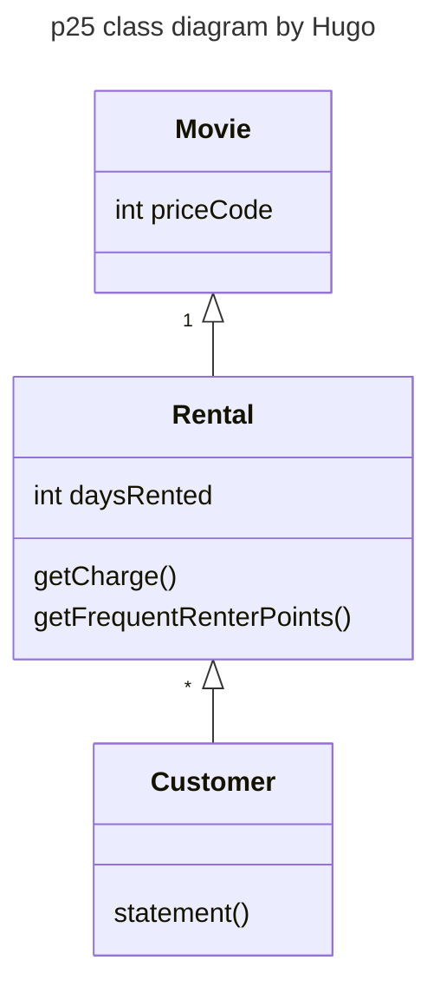

> [!NOTE]
> `frequentRenterPoints()` move to `Rental` class

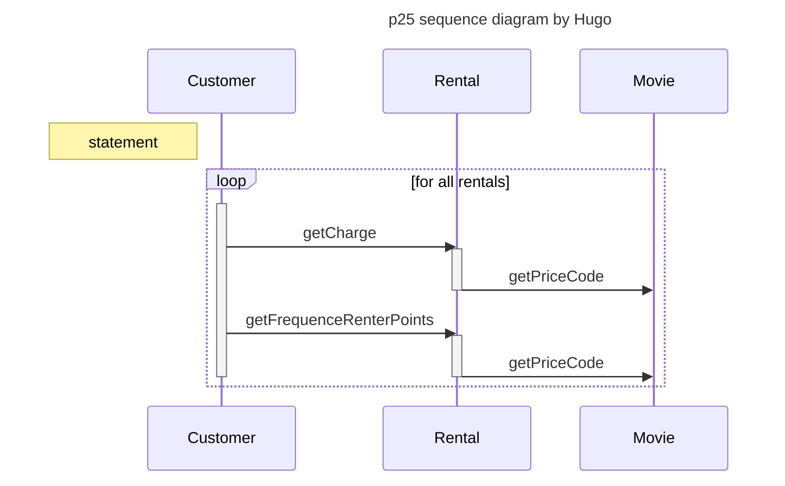

> [!NOTE]
> - temp variables can be a problem, which encourage long routines
> - remove temps `totalAmounts` and `frequentRenterPoints`


## Review [`p33.java`](./movie-p33.md)

一旦我做了 centralize 我 copy-paste 不會造成傷害

a `htmlStatement()` method is added. 👉🏻 now if we want to change rule, only one place should be changed.

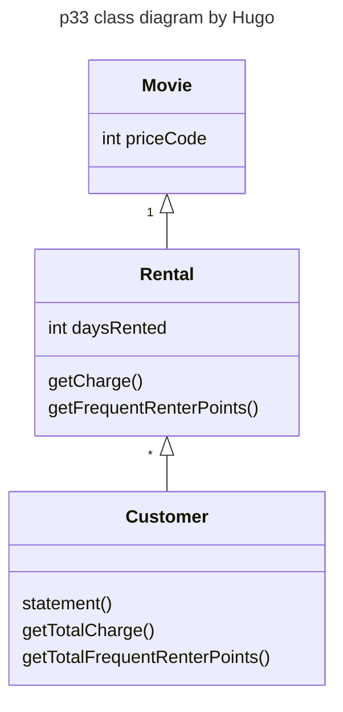

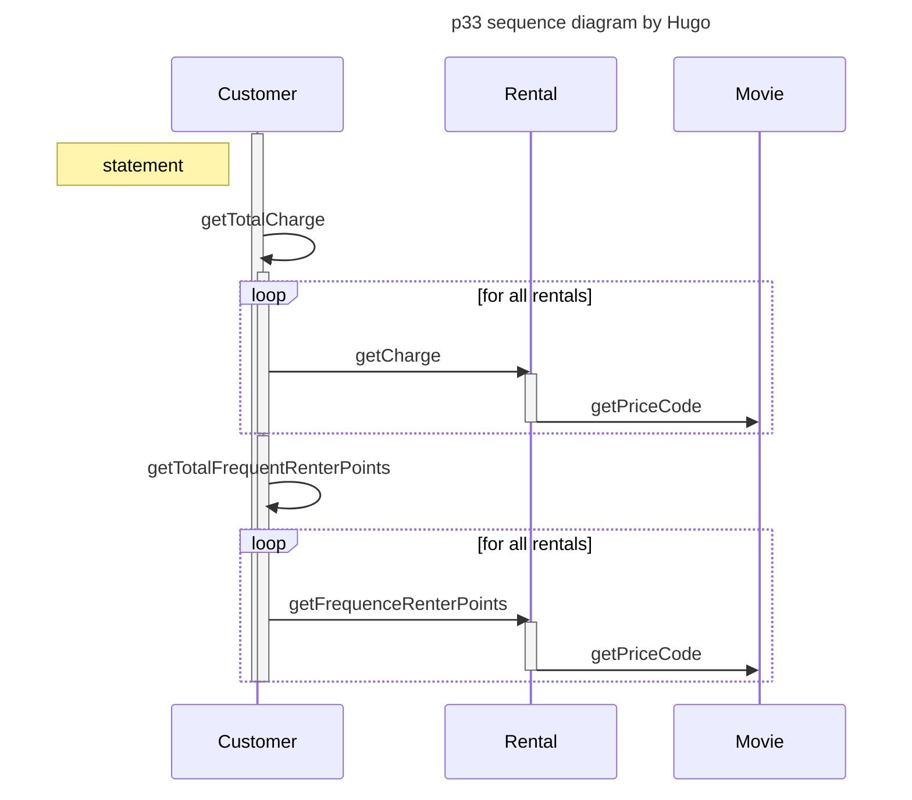

> [!NOTE]
> It is a bad idea to do a switch based on an attribute of another object
> 
> For example, when a new movie class called `Adult` is added, changes are
> - Change the definition in movie class.
> - `Rental::getCharge()` should be changed

## Review [`p37.java`](./movie-p37.md)

Let's move `getCharge()`, `getFrequentRenterPoints()` 的 code 搬到 movie class


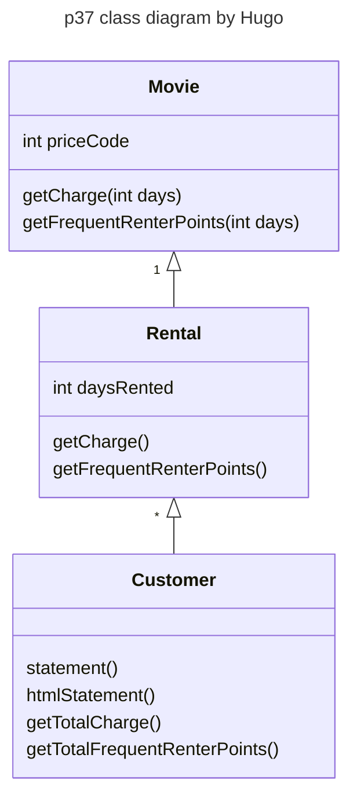

> [!NOTE]
> - So, how about it now? perfect? not yet
> - switch in `getCharge()` is a typical bad code which cannot answer changes well.
> - In practice, such `switch()` can occurs in several places (recall that when polymorphism is introduced). Each switch must be kept consistent。
> - Often, a switch that will change from time to time satisfies  the precondition of  subclassing. We can replace it by polymorphism and inheritance 


In the original, we will design this `switch` case (procedure design) in our code:

```cpp
// xxx.cpp

    ...
    switch () {
        A : create A;
        B : create B;
    }

// yyy.cpp

    ...
    switch () {
        A : modify A;
        B : modify B;
    }
```

However, we don't want to do this because it's hard for us to maintain or add the feature in the future. We can use `Polymorphism` to solve this problem.


```cpp
class A : base {
    ...
    void createA() = 0;
    void modifyA() = 0;
}

class B : base {
    ...
    void createB() = 0;
    void modifyB() = 0;
}
```

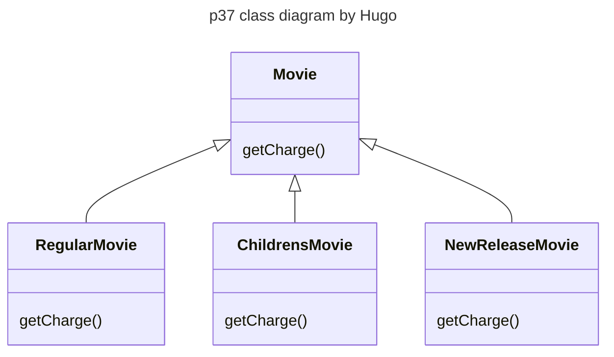


> [!NOTE]
> Move each branch of switch to subclasses getCharge(),  replace switch statement with polymorphism
> 
> **Feeling good? (自我感覺良好嗎?)**
> 
> - Unfortunately, such inheritance structure has flaw. However, amateur OO analysts will most reach such kind of results 
> - In this application, a movie object may change its classification during life time
>   - E.g., suppose a new release film Q changes to a regular movie
>   - Consequently, what will you do?
>     - New a regular movie P
>     - Clone the data of Q to P
>     - Destroy Q
>     - That's it?  (No. take a look at the `main()`)


```java
Movie m1 = new ReleaseMovie("Seven", MOVIE.NEW_RELEASE)
...
...
Movie m4 = new RegularMovie("Seven", MOVIE.REGULAR)
m4 = m1.clone();

// 過去有租 m1 的有 r1, r2 我們要通通找出來各別處裡
delete m1;
...
...

// Write additional many many code to deal with the shit
```

> [!IMPORTANT]
> An object cannot change its class during life time

State Design Pattern

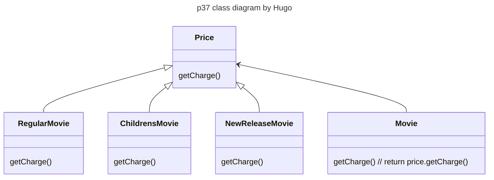


## Review [`p52.java`](./movie-p52.md)

這邊的變動會在 GUI 的設計之中

```java
22     public void setPriceCode(int arg) {   // <-- changed
23         switch (arg) {
24             case REGULAR:               // 普通片
25                 _price = new RegularPrice();
26                 break;
27             case CHILDRENS:             // 兒童片
28                 _price = new ChildrensPrice();
29                 break;
30             case NEW_RELEASE:           // 新片
31                 _price = new NewReleasePrice();
32                 break;
33             default:
34                 throw new IllegalArgumentException("Incorrect Price Code");
35         }
36     }
```

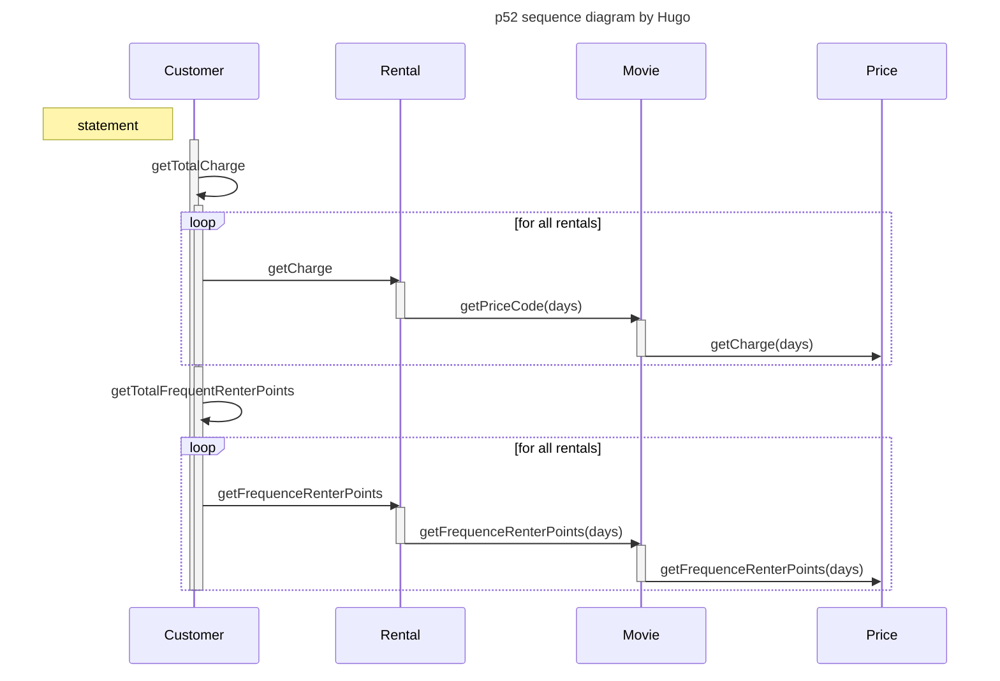

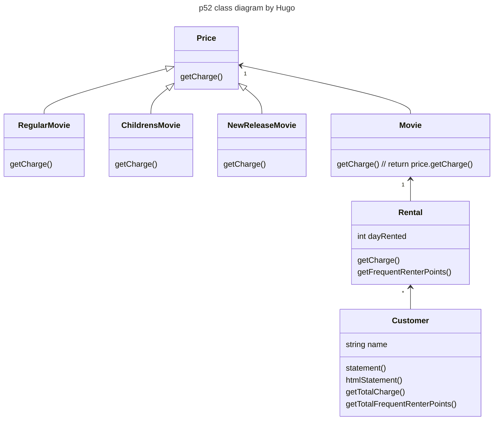

> [!NOTE]
> **Design Pattern**
>
> - When you encounter some problems in OOAD or OOP. It is rare that your problem is new. 
> - Some people collects these problems and solution into a some form of reuses.
> - design patterns are one kind of reuse, but not code reuse. Instead, it is a kind of pattern reuse.

> [!NOTE]
> 
> - The main purpose of OOAD is to make our code easy to maintain, change, and evolve,
> - Good analysis is difficult
> - Don't expect you will become a OOAD expert because you take the course.
> - Typically, having analysis is better than no analysis. Recall the integrity of architecture and thought. 


> [!NOTE]
> - `Good architecture != good performance`
> - In most cases, good architecture may have worse performance.
> - In some design concerns, some classes will be merged to increase performance (if they are found to be guilty of the blame)
> - Programmers that can write good and clean `OO` code are hard to find.
> - Good analysis, of course, can be used to create good teamwork (WBS work breaking structure)
> - Good analyst can smell the change in system design and make the part `OO` ly


> [!IMPORTANT]
> Don't **overdesign**. If the change will not occurs within 100 years, make the part OOly is a waste of time. Good OOAD must eventually demonstrate at the level of code. (Extensive programming experience is required.)

> [!NOTE]
> In a software development project. How much efforts should be put in OOAD?
> 
> - What type of software  you build (what kind of market you are in)?
>   - e.g. there is no need for analysis for most research
> - Is evolveability very important in your area?
> - is technology changing very fast in your area?
> - How long is your design/code typically out of date and thrown away?
> - what is the scale of your software?
> - what is the total cost of your software?
> - Are documentation/process important in your company?
> - Have your programmers high transition rate?
> - How much quality you care?
> - 6 month design/planning, 3 month coding, 3 month testing

