# Material 12 - UML Diagram<!-- omit in toc -->

<div align="right">
    <p>
        <a href="#table-of-contents" target="_blank"><b>☝🏼 [Back to TOC]</b></a> 
    </p>
</div>

> [!NOTE]
> An object-oriented program may be viewed as a collection of **interacting objects**; **UML (Unified Modeling Language)** can be used to express object relationships

Use cases
Class diagrams
Interaction diagrams (Sequence & communication diagrams)
Package diagrams
State diagrams
Activity diagrams
Deployment diagrams

## UML Class Diagrams

Can be used for different perspectives

- **Conceptual:** Describe things in a situation of the real world or domain of interest (e.g. domain model)
- **Implementation:** Describe software implementations in a particular technology (e.g. design class diagram)

### UML: Class

```cpp
+ public
# protected
- private

Abstract
Concrete

- data type: int, string, etc.
- parameter: name
```

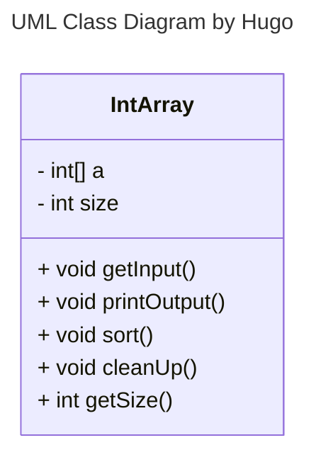

### UML: Relationships

An object is related to some other objects

#### "Use a" (Dependency)

X issues a function call to a member function of Y 

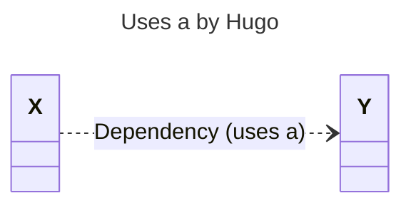

> [!NOTE]
> Short term relationship

#### "Knows a" (Association)

- X is aware of Y; X contains a pointer or reference to Y
- X can issue a function call to a member function of Y

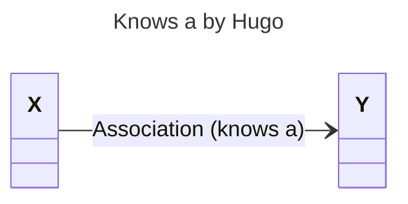

> [!NOTE]
> Long term relationship

#### "Is a" (Inheritance)

- X class is derived from Y class
- X is derived from Y

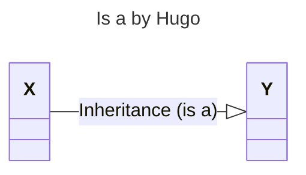

#### "Has a" (Composition)

X contains Y as members

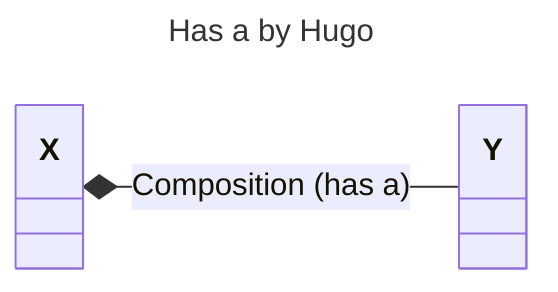

#### "Can do" (Implementation)

- X can do (replace) the jobs of Y; but X is not Y.

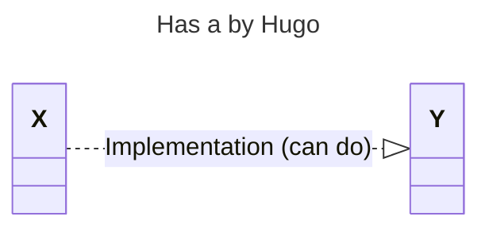

> [!NOTE]
> Many OO languages allows only single inheritance


#### "Aggregation"

A y object can be shared, i.e., a Y object may belong to several different objects

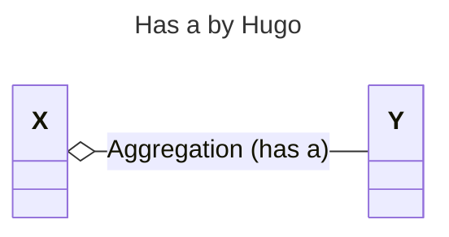

> [!NOTE]
> Following Larman OOAD: use of aggregation is NOT recommended; **use association instead**


#### "Composition"

- A stronger variety of aggregation
- A Y object may belong to only one X object
- A Y object is expected to live and die with the X object

> [!NOTE]
> delete X -> delete Y


### Example: "Has a" Relationship

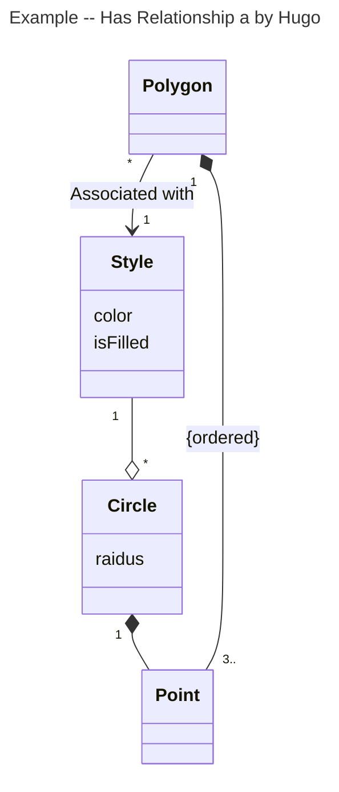

> [!NOTE]
> 1. a Style may be shared by many Polygons and Circles
> 2. Delete Polygon -> delete Style; Delete Polygon -x-> delete Style
> 3. a Point may appear in only one Polygon or Circle


### Example: "Dependency"

```cpp
class X {
    ...
    void f1(Y  y) {...; y.Foo(); }
    void f2(Y *y) {...; y->Foo(); }
    void f3(Y &y) {...; y.Foo(); }
    void f4(    ) {Y y; y.Foo(); ... }
    void f5(    ) {...; Y::StaticFoo(); }
};
```

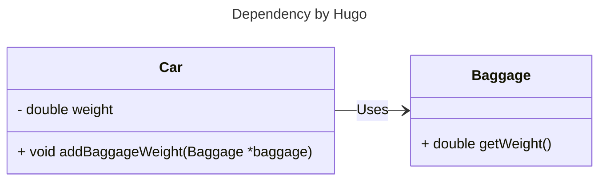

```cpp
class Car {
public:
    ...
    void addBaggageWeight(Baggage *baggage);
    ...
private:
    double weight;
};
void Car::addBaggage(Baggage *baggage) {
    weight += baggage.GetWeight();  // Car uses Baggage
}
```

### Example: "Association"

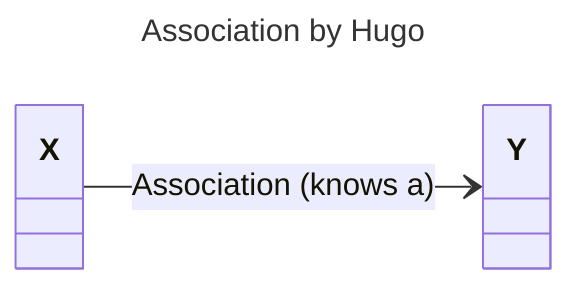

```cpp
class X {
    X(Y *y) : y_ptr(y) { }
    void SetY(Y *y) { y_ptr = y; }
    ...
    void f() {y_ptr->Foo();}
    
    Y *y_ptr; // X keeps a pointer (reference) to Y
};
```

> [!NOTE]
> ```cpp
> class X {
> public:
>     // Constructor that initializes the pointer to Y
>     X(Y *y) : y_ptr(y) { }
> 
>     // Function to set the pointer to a new instance of Y
>     void SetY(Y *y) { y_ptr = y; }
>     
>     // Member function that calls a method on Y
>     void f() { y_ptr->Foo(); }
> 
> private:
>     // Pointer to an instance of Y
>     Y *y_ptr; 
> };
> ```

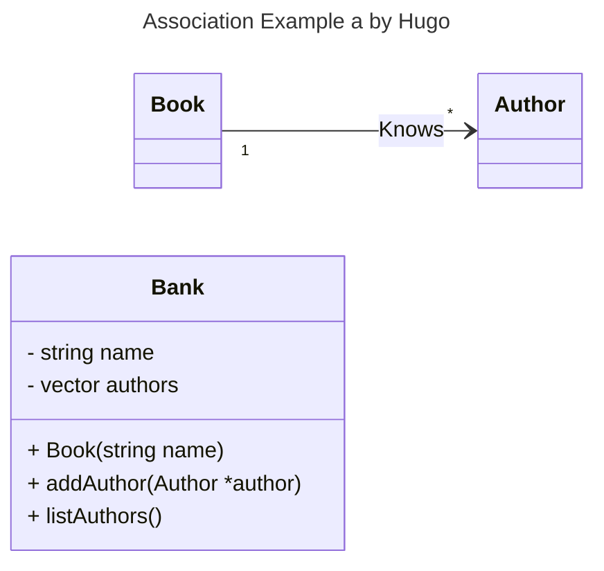


```cpp
class Book {
public:
    Book(string name);
    void addAuthor(Author *author);
    void listAuthors();
private:
    string name;
    vector<Author*> authors;
};

void Book::listAuthors() {
    cout << "Authors of " << name
         << " are:\n";
    for(size_t i = 0; i < authors.size(); i++)
        cout << "   " 
             << authors[i]->getName()
             << endl;
}
```

> [!NOTE]
> **How is an association created?**
> 
> ```cpp
> Example #1
> ...
> Author a();
> Book b(&a);     // Association by constructor
> ...
> b.ListAuthor();
> ...
> 
> Example #2
> ...
> Author a();
> Book b();
> ...
> b.addAuthor(&a);    // Association by member function
> ...
> b.ListAuthor();
> ...
> ```
>
> In `Example #1`, the association is created by the constructor of `Book` class. In `Example #2`, the association is created by the member function `addAuthor` of `Book` class.

### Example: "Composition"

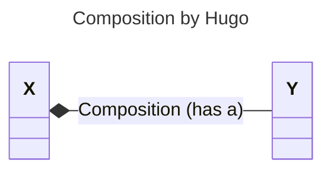

```java
class X {
    X() { y_ptr = new Y[10]; }
    ~X(){ delete [] y_ptr; }
    ...
    Y a;         // 1; Composition
    Y *y_ptr;   // 0..10; Composition
    ...
};
```

> [!WARNING]
> `*y_ptr` is NOT a Association, it is a Composition

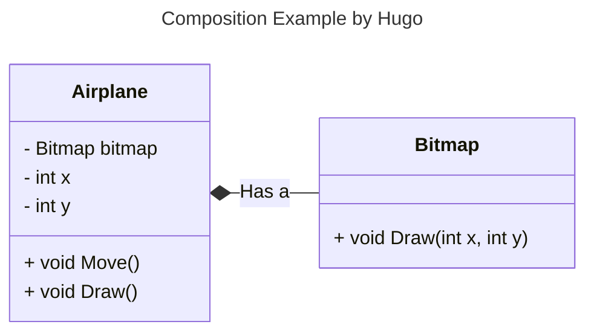


```cpp
class Airplane {
public:
    ...
    void Move();
    void Draw();
private:
    Bitmap bitmap;
    int x, y;
};

void Airplane::Move() {
    x += ...;
    y += ...;
}

void Airplane::Draw() {
    bitmap.Draw(x, y);
}
```

> [!NOTE]
> How about Vector/List...?
> 
> ```mermaid
> ---
> title: Composition Example by Hugo
> ---
> classDiagram
> direction LR
>     class X {
>         vector<Y> y_list
>     }
>     X *-- Y: Composition (has a)
> ```
>
> ```cpp
> class X {
>     ...
>     vector<Y> a;  // Hiding implementation details
>     ...
> };
> ```
>
> NOT Composition of `Y` 👉🏻 Composition of `vector<Y>`


> [!IMPORTANT]
> Use Association instead of Aggregation

### Example: "Implementation"


```cpp
class Y {
    ...
};

class X : public Y {
    ...
};
```

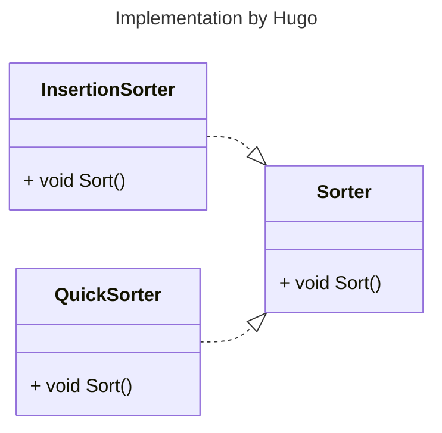

```csharp
// X can do the job of Y
class Y {
    ...
};

class X : public Y {
    ...
};
```

> [!NOTE]
> `C++` Allows multiple inheritance

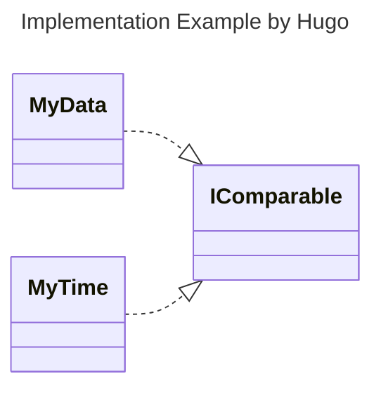

### Example: "UML Class Diagram"

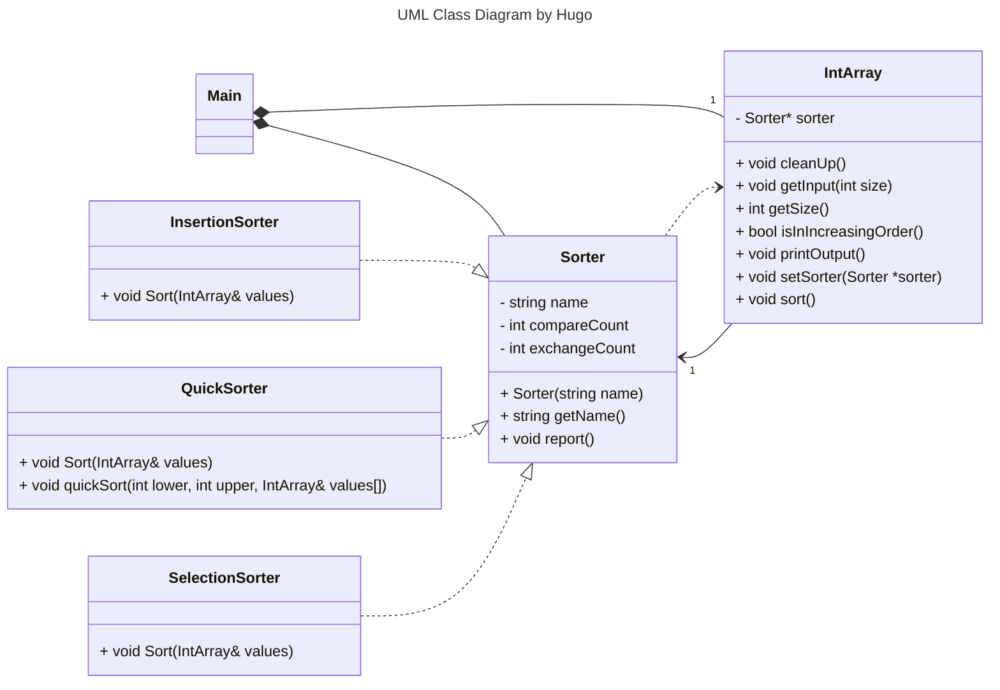

### Example: "Logic Circuit Simulator"


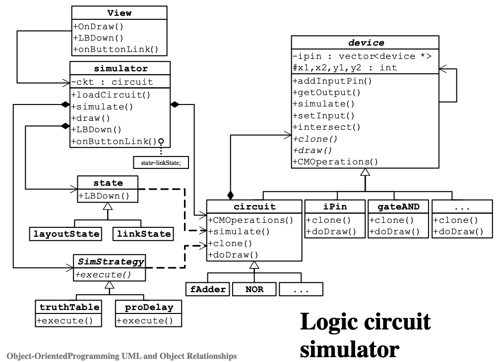