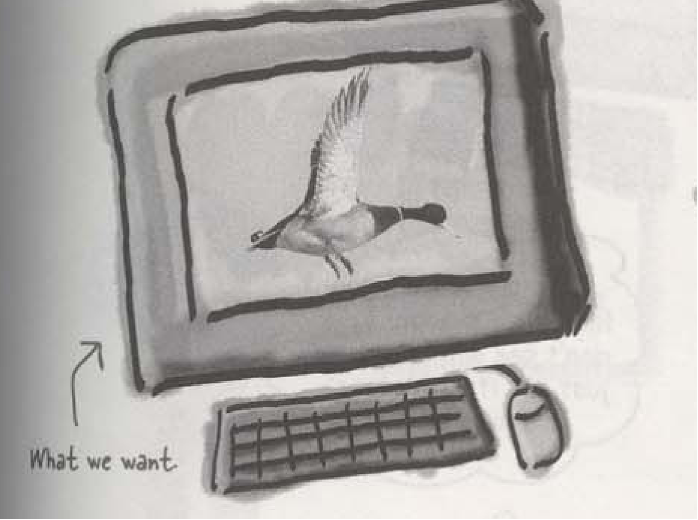

# Material 14 - Design Pattern 1 <!-- omit in toc -->

**Table of Contents**
- [Why Patterns?](#why-patterns)
  - [Alexander on Patterns](#alexander-on-patterns)
- [Design Patterns](#design-patterns)
  - [Practice of Design Pattern](#practice-of-design-pattern)
- [Criticism](#criticism)
- [In real world](#in-real-world)
- [Teacher's WORDS](#teachers-words)
  - [Meet the UGLY Truth](#meet-the-ugly-truth)
  - [Suggestions](#suggestions)
- [Talk about the Strategy of Design Pattern](#talk-about-the-strategy-of-design-pattern)
  - [The OO design](#the-oo-design)
    - [How about an Interface?](#how-about-an-interface)
    - [Truth](#truth)
  - [Recall the purpose of SE and OOAD](#recall-the-purpose-of-se-and-ooad)
  - [Design Principle](#design-principle)
  - [What is polymorphism?](#what-is-polymorphism)
    - [Let’s put them altogether](#lets-put-them-altogether)
    - [To define a new kind of Duck](#to-define-a-new-kind-of-duck)
    - [The magic – you can have a duck whose behavior can change in runtime](#the-magic--you-can-have-a-duck-whose-behavior-can-change-in-runtime)
    - [Setting behavior dynamically](#setting-behavior-dynamically)
  - [An entire solution](#an-entire-solution)
  - [Design Principle](#design-principle-1)
- [Singleton Pattern](#singleton-pattern)
- [DEEP TALK on Singleton Pattern](#deep-talk-on-singleton-pattern)
  - [Why Global Variables Should Be Avoided When Unnecessary!](#why-global-variables-should-be-avoided-when-unnecessary)
  - [Side effects](#side-effects)
  - [The stupid way in Java (pure OOPL)](#the-stupid-way-in-java-pure-oopl)
  - [The Control Class Solution (learned from experience)](#the-control-class-solution-learned-from-experience)
  - [The Singleton Pattern](#the-singleton-pattern)
    - [How to use a singleton object?](#how-to-use-a-singleton-object)
    - [To call singleton methods](#to-call-singleton-methods)
  - [Singleton with multithreading](#singleton-with-multithreading)
    - [The Singleton Pattern for Multi-thread-Safe – first solution](#the-singleton-pattern-for-multi-thread-safe--first-solution)
    - [The Singleton Pattern for Multi-thread-Safe – Double Check lock solution](#the-singleton-pattern-for-multi-thread-safe--double-check-lock-solution)
  - [More Tutorial on Java Synchronized Keyword](#more-tutorial-on-java-synchronized-keyword)
  - [What the hell is "singleton.class"?](#what-the-hell-is-singletonclass)
- [Composite Pattern](#composite-pattern)
  - [Design Pattern: Composite](#design-pattern-composite)
- [Proxy Pattern](#proxy-pattern)
- [Observer Pattern](#observer-pattern)
- [Strategy Pattern](#strategy-pattern)
- [Visitor Pattern](#visitor-pattern)
  - [Problem](#problem)

## Why Patterns?

> [!NOTE]
> What's New Here is that Nothing is New Here

Patterns are about what works, and give us a way to talk about what works, a pithy design vocabulary. They distill experience.

sfd
### Alexander on Patterns

Patterns in solutions come from patterns in problems.

> "A pattern is a solution to a problem in a context."

> "Each pattern describes a problem which **occurs over and over again** in our environment, and then describes the core of the solution to that problem, in such a way that you can **use this solution a million times over**, without ever doing it the same way twice." Christopher Alexander -- A Pattern Language

> [!NOTE]
> 如果你想解決一個問題，可以先去翻書找過去的方法，在書上找找看有沒有解決這個問題的方法。

## Design Patterns

過去，在實做各種各類的軟體過程中，許多人累積了寶貴的物件導向分析經驗。經過蒐集整理，這些寶貴的繼承架構，class diagram，物件互動架構等等，被蒐集成所謂的 design patterns。

> [!NOTE]
> design patterns are one kind of reuse, but not code reuse. Instead, it is a kind of **pattern reuse**.

> [!TIP]
> Design Patterns: Elements of Reusable Object-Oriented Software Erich Gamma, Richard Helm, Ralph Johnson, and John Vlissides Addison Wesley, 1995
>
> A landmark book that changed the way programmers think about building object-oriented programs

### Practice of Design Pattern


In order to achieve flexibility, design patterns usually introduce additional levels of **indirection**, which in some cases **may complicate the resulting designs** and **hurt application performance**.

Often, people only understand how to apply certain software design techniques to certain problems[^1]. These techniques are difficult to apply to a broader range of problems. Design patterns provide general solutions, documented in a format that does not require specifics tied to a particular problem. 

> [!NOTE]
> Design patterns are not a **silver bullet** to all problems. No design pattern is a panacea. Use them wisely.

## Criticism

- Targets the wrong problem
- The need for patterns results from using computer languages or techniques with insufficient abstraction ability. Under ideal factoring, a concept should not be copied, but merely referenced. But if something is referenced instead of copied, then there is no "pattern" to label and catalog. Paul Graham writes in the essay Revenge of the Nerds.
- Peter Norvig provides a similar argument. He demonstrates that 16 out of the 23 patterns in the Design Patterns book (which is primarily focused on C++) are simplified or eliminated (via direct language support) in Lisp or Dylan
- Leads to inefficient solutions
- The idea of a design pattern is an attempt to standardize what are already accepted best practices. In principle this might appear to be beneficial, but in practice it often results in the unnecessary duplication of code. It is almost always a more efficient solution to use a well-factored implementation rather than a "just barely good enough" design pattern.
- Passionate (Patterners)  force their code into this pattern and that pattern they typically miss the fact that they are more often than not INCREASING complexity rather than following Fowler's first rule of KISS (keep it simple and stupid). Other than that they seem like genuinely intelligent people. Go figure.
- Design pattern make code obscure and difficult to understand
- "The OVERUSE is worst thank NO USE it at all"
- Is important to understand and use all these things, but more important is how and where to use them
- I would also like to add that sometimes extensive use of design patterns is overkill. Some problems, especially if the requirements and future change is very predictable and stable, can be solved very easily without employing design patterns. It's also fair to say that once a developer/designer is fluent in the use of design patterns he/she can incorporate them into a solution as easily as using any other design construct. But this doesn't mean that the next guy who comes along and is going to maintain that project or make some changes to it has the same intimacy with design patterns as the first designer therefore we have another overkill. To sum up, design patterns should be used wisely and where needed and like any other tool that we have at our disposal if you try to fix everything using design patterns you're going to end up in a big mess.

## In real world


As a programmer
- You have deadline
- you have so many features to catch on
- You have so many bugs to fix
- acceptable, usable v.s. best, optimal


> [!WARNING]
> Do not turn yourself into NERD
> 
> 

## Teacher's WORDS

- SE, OO are meant to solve software development problem in practical world
- The real world is dirty
- It is impractical to build a pure, perfect, optimal software in practice.
- In human history, software evolve and advance gradually.
- every thing has a price (cost)

### Meet the UGLY Truth

```cpp
if (type == "wop") {
    assert(false);
    xp.type = T_WOP ;
    xp.wop_nodetype = this ;
    xp.val_wop = _wop;
} else if (type == "varname") {
    xp.type = T_STRING ;
    xp.val_string = _wop->getName();
} else if (type == "int*") {
    xp.type = TP_INT ;
    WOP_Int_Proxy * iwop = dynamic_cast<WOP_Int_Proxy*>(_wop);
    assert(iwop != NULL) ;
    xp.val_int_ptr = iwop->getIntValAddr();
    //xp.original = _wop->getVal();
} else if (type == "int") {
    xp.type = T_INT ;
    WOP_Int_Proxy * iwop = dynamic_cast<WOP_Int_Proxy*>(_wop);
    assert(iwop != NULL) ;
```

### Suggestions

1. Plot a draft design and code first 
2. Unless it is clear that a design pattern is necessary, otherwise, focus on solving the problem itself.
3. Discover the problems of your implementation and its extension and future change
4. See through the nature of your problem and find a design pattern to address it.

> [!NOTE]
> 
> Please focus on the future change and extension of your software, once your software even no requirements to change, you can ignore the design pattern.

## Talk about the Strategy of Design Pattern


Joe works for a company that makes a highly successful duck pond simulation game, SimUDuck. The game can show a large variety of duck species swimming and making quacking sounds. The initial designers of the system used standard `OO` techniques and created on Duck superclass from which all other duck types inherit.


### The OO design


> [!NOTE]
>
> - All ducks quack and swim, the superclass takes care of the implementation code.
> - Each duck subtype is reponsible for implementing its own `display()` behavior for how it looks on the screen.
> - The `display()` method is `abstract`, since all duck subtypes look different.


> [!WARNING]
>
> **Remember ! Software change !**
> 
> The executives decided that flying ducks is just what the simylator needs to blow away the other duck sim competitors. And of course Joe's manager told them it'll be no problem for Joe to just whip something up in a week. "After all", said Joe's boss, "he's an `OO` programmer... *how hard can it be?*"
>
> 

> **Joe:** 
> 
> I just need to add a `fly()` method in the Duck class and then all the ducks will inherit it. Now's my time to really show my true OO genius.


> [!NOTE]
> All subclasses inherit `fly()`


> [!WARNING]
>
> **Something horribly wrong**
>
> **Joe's Boss:** 
> 
> Joe, I'm at the shareholder's meeting. They just gave a demo and there were **rubber duckies flying around the screen**. Was this your idea of a joke? You might want to spend time on `Monster.com` ...


> **What happened?**
> 
> Joe failed to notice that not all subclasses of Duck should *fly*. When Joe added new behavior to the Duck superclass, he was also adding behavior that was **NOT** appropriate for some Duck subclasses. He now has flying inanimate objects in the SimUDuck program.
> 
> *A localized update to the code caused a non-local side effect (flying rubber ducks)!*


> What he thought was a great use of inheritance for the purpose of **REUSE** hasn't turned out so well when it comes to **MAINTENANCE**.


> [!NOTE]
>
> By putting `fly()` in the superclass he gave flying ability to ALL ducks, including those that shouldn't fly.
>
> Rubber ducks don't quack, so `quack()` is overridden to "Squeak."

> **Joe:** 
> 
> I could always just overrid the `fly()` method in rubber duck, the way I am with the `quack()` method...


> **Joe:**
> 
> But then what happens when we add wooden decoy ducks to the program? They aren't supposed to fly or quack...


> [!NOTE]
>
> Here's another class in the hierarchy; notice that like `RubberDuck`, it doesn't fly, but it also doesn't quack.

#### How about an Interface?

Joe realized that inheritance probably wasn't the answer, because he just got a memo that says that the executives now want to update the product every six months (in ways they haven't yet decided on). Joe knows the spec will keep changing and he'll be forced to look at and possibly override `fly()` and `quack()` for every new Duck subclass that's ever added to the program ... *forever*.

So, he needs a cleaner way to have only *some* (but not *all*) of the ducks types fly or quack.

> **Joe:** 
> 
> I could take the `fly()` out of the Duck superclass, and make a ***`Flyable()` interface*** with a `fly()` method. That way, only the ducks that are supposed to fly will implement that interface and have a `fly()` method ... and I might as well make a Quackable, too, since not all ducks can quack.


> [!IMPORTANT]
>
> WHAT DO YOU THINK ABOUT THIS DESIGN?

#### Truth

> **Joe's Boss:**
> 
> That is, like, the dumbest idea you've come up with. **Can you say, "duplicate code"?** If you thought having to override a few methods was bad, how are you gonna feel when you need to make a little change to the flying behavior... in all 48 of the flying Duck subclasses?!

We know that not *all* of the subclasses should have flying or quacking behavior, so inheritance isn't the right answer. But while having the subclasses implement Flyable and/or Quackable soves *part* of the problem (no inappropriately flying rubber ucks), it completely destroys code reuse for those behaviors, so it just creates a **different** maintenance nightmare. And of course there might be more than one kind of flying behavior even amoung the ducks that **do** fly...

At this point you migh be waiting for a Design Pattern to come riging in on a white house and save the day. But what fun would that be? **No**, we're going to figure out a solution the old-fashioned way -- ***by applying good OO software design principles.***

### Recall the purpose of SE and OOAD

> : Wouldn't it be dreamy if only there were a way to build software so that when we need to change it, we could do so with the least possible impact on the existing code? We could spend less time reworking code and more making the program do cooler things...

So we know using inheritance hasn't worked out very well, since the duck behavior keeps changing across the subclasses, and it's not appropriate for **all** subclasses to have those behaviors. The `Flyable` and `Quackable` interface sounded promising at first -- only ducks that really do fly will be Flyable, etc. -- except Java interfaces have no implementation code, **so no code reuse**. And that means what whenever you need to modify a behavior, you're forced to track down and change it in all the different subclasses where that behavior id defined, probably introducing new *bugs* along the way.

> [!NOTE]
> Java's Interface no code in it, just a declaration, 

### Design Principle

> [!IMPORTANT]
> 
> Take what varies and "encapsulate" it so it won't affect the rest of your code.
> 
> The result? Fewer unintended consequences from code changes and more flexibility in your systems!

We know that `fly()` and `quack()` are the parts of the Duck class that vary across ducks.

To separate these behaviors from the Duck class, we'll pull both methods out of the Duck class and create a new set of classes to represent each behavior.


> [!IMPORTANT]
> 
> **From now on, the Duck behaviors will live in a separate class -- a class that implements a particular behavior interface.**
>
> **That way, the Duck classes won't need to know any of the implementation details for their own behaviors.**


> [!IMPORTANT]
>
> **Design Principle**
>
> Program to an interface, not an implementation


> [!NOTE]
>
> `abstract` supertype (could be an abstract class OR interface)

**Programming to an implementation** would be:

```java
Dog d = new Dog();
d.bark();
```

> [!NOTE]
>
> Declaring the variable `d` as type `Dog` (a concrete implementation of `Animal`) forces us to code to a concrete implementation.

But **programming to an interface/supertype** would be:

```java
Animal animal = new Dog();
animal.makeSound();
```

> [!NOTE]
>
> We know it's a Dog, but we can now use the animal reference polymorphically.

> [!NOTE]
> `Animal dog = new Dog();` NOT `Dog dog = new Dog();`
> 
> Animal 才是所謂的 Core 程式碼

Even better rather than hard-coding the instantiation of the subtype (like `new Dog()`) into the code, **assign the concrete implementation object at runtime.**

```java
a = getAnimal();
animal.makeSound();
```

> [!NOTE]
>
> We don't know WHAT the actual animal subtype is ... all we care about is that it knows how to respond to `makeSound()`.

### What is polymorphism?


> [!NOTE]
>
> - `FlyBehavior`: Here we have an interface that all flying classes implement. All new flying classes just need to implement the fly method
> - `FlyWithWings`: Here's the implementation of flying for all ducks that have wings
> - `FlyNoWay`: And here's the implementation of all ducks that can't fly.

> [!NOTE]
>
> - `QuackBehavior`: Same thing here for the quack behavior; we have an interface that just includes a `quack()` method that needs to be implemented.
> - `Quack`: Quacks that really quack.
> - `Squeak`: Quacks that squeak.
> - `MuteQuack`: Quacks that make no sound at all.


With this design, other types of objects can reuse our fly and quck behaviors because these behaviors are no longer hidden away in our Duck classes!

And we can add new behaviors without modifying any of our existing behavior classes or touching any of the Duck classes that use flying behaviors.

> [!NOTE]
>
> So we get the benefit of REUSE without all the baggage that comes along with inheritance.

> [!IMPORTANT]
>
> **Q: It feels a little weird to have a class that's just a behavior. Aren't classes suposed to represent things? Aren't classes supposed to have both state AND behavior?**
>
> A: **In an `OO` system, yes,** classes represent things that generally have both state (instance variables) and mehtods. And in this case, the thing happens to be a behavior. But even a behavior can still have state and methods; a flying behavior might have instance variables representing the attributes for the flying (wing beats per minute, max altitude and speed, etc.) behavior.
> 

#### Let’s put them altogether


<!-- ```mermaid
classDiagram
    note "Author: Hugo"
    class Duck {
        - FlyBehavior flyBehavior
        - QuackBehavior quackBehavior
        + void performQuack()
        + void swim()
        + void display()
        + void performFly()
        // OTHER duck-like mehtod()
    }
``` -->


**2. Now we implement `performQuack()`:**

```java
public class Duck {
    /**
     * Each Duck has a reference to something that implements the QuackBehavior interface.
     */
    QuackBehavior quackBehavior;
    // more

    /**
     * Rather than handling the quack behavior itself, the Duck object delegates that behavior to the object referenced by quackBehavior.
     */
    public void performQuack() {
        quackBehavior.quack();
    }
}
```

#### To define a new kind of Duck

```java
public class MallardDuck extends Duck {
    public MallardDuck() {
        /**
         * A MallardDuck uses the Quack class to handle its quack, so when performQuack is called the respansibility for the quack is delegated to the Quack object and we get a real quack.
         */
        quackBehavior = new Quack();
        /**
         * And it uses FlyWithWings as its FlyBehavior type.
         */
        flyBehavior = new FlyWithWings();
    }

    public void display() {
        System.out.println("I'm a real Mallard duck");
    }
}
```

> [!NOTE]
>
> Remember, MallardDuck inherits the quackBehavior and flyBehavior instance variables from class Duck.

#### The magic – you can have a duck whose behavior can change in runtime

So, we still have a lot of flexibility here, but we;re doing a poor job of initializing the instance variables in a flexible way. But think about it, since the quackBehavior instance variable is an interface type, we could (through the magic of polymorphism) dynamically assign a different QuackBehavior implementation class at runtime.

Take a moment and think about how you would implement a duck so that its behavior could change at runtime. (You'll see the code that does this a few pages from now.)

**1. Type and compile the Duck class below (`Duck.java`), and the MallardDuck class from tow pages back (`MallardDuck.java`).**

```java
public abstract class Duck {
    // Declare two reference variables for the behavior interface types. All duck subclasses (in the same package) inherit these.
    FlyBehavior flyBehavior;
    QuackBehavior quackBehavior;
    public Duck() { 
    }

    public abstract void display();

    // Delegate to the behavior class
    public void performFly() {
        flyBehavior.fly();
    }
    public void performQuack() {
        quackBehavior.quack();
    }

    public void swim() {
        System.out.println("All ducks float, even decoys!");
    }
}
```

**2. Type and compile the FlyBehavior interface (`FlyBehavior.java`) and the two behavior implementation classes (`FlyWithWings.java`) and (`FlyNoWay.java`).**

```java
public interface FlyBehavior {
    public void fly();
}
```

> [!NOTE]
>
> The interface that all flying behavior classes implement.

```java
public class FlyWithWings implements FlyBehavior {
    public void fly() {
        System.out.println("I'm flying!!");
    }
}
```

> [!NOTE]
>
> Flying behavior implementation for ducks that **DO fly**...

**4. Type and compiile the test class (`MiniDuckSimulator.java`)**.

```java
public class MiniDuckSimulator {
    public static void main(String[] args) {
        Duck mallard = new MallardDuck();
        /**
         * This calls the MallardDuck's inherited performQuack() method, which then delegates to the object's quackBehavior (i.e. calls quack() on the duck's inherited quackBehavior reference).
         */
        mallard.performQuack();
        /**
         * Then we do the same thing with MallardDuck's inherited performFly() method.
         */
        mallard.performFly();
    }
}
```

**5. Run the code!**

```bash
$ java MiniDuckSimulator

Quack
I'm flying!!
```

#### Setting behavior dynamically

What a shame to have all this dynamic talent built into our ducks and not be using it! Imagine you want to set the duck's behavior type through a setter method on the duck subclass, tather than by instantiating it in the duck's constructor.


**1. Add two new methods to the Duck Class:**

```java
public void setFlyBehavior(FlyBehavior fb) {
    flyBehavior = fb;
}

public void setQuackBehavior(QuackBehavior qb) {
    quackBehavior = qb;
}
```


> [!NOTE]
>
> We can call these methods anytime we want to change the behavior of a duck **on the fly**.

**2. Make a new Duck Type (`ModelDuck.java`)**

```java
public class ModelDuck extends Duck {
    public ModelDuck() {
        flyBehavior = new FlyNoWay();
        quackBehavior = new Quack();
    }

    public void display() {
        System.out.println("I'm a model duck");
    }
}
```

> [!NOTE]
> Our model duck begins life grounded... without a way to fly.

**3. Make a new FlyBehavior Type (`FlyRocketPowered.java`)**

```java
public class FlyRocketPowered implements FlyBechavior {
    public void fly() {
        System.out.println("I'm flying with a rocket!");
    }
}
```

> [!NOTE]
>
> That's okay, we're creating a rocket powered flying behavior.

### An entire solution

Pay careful attention to the relationships between the classes. In fact, grab your pen and write the appropriate relationship (IS-A, HAS-A, and IMPLEMENTS) on each arrow in the class diagram.


> [!NOTE]
> 
> Client makes use of an encapsulated family of algorithms for both flying and quacking.


> [!NOTE]
>
> Think of each set of behaviors as a family of algorithms.


### Design Principle

**Favor composition over inheritance.**

> [!IMPORTANT]
>
> **HAS-A can be better than IS-A**
>
> The HAS-A relationship is an interesting one: each duck has a FlyBehavior and a QuackBehavior to which it delegates flying and quacking.
>
> When you put two classes together like this you're using `composition`. Instead of `inheriting` their behavior, the ducks get their behavior by being `composed` with the right behavior object.
>
> This is an important technique; in fact, we've been using our third design principle: **Favor composition over inheritance**.


> [!NOTE]
> Has a bettere than Is a (composition is better than inheritance)


## Singleton Pattern

Rationale and Motivation

- The singleton pattern applies to the many situations in which there needs to be a single instance of a class, a single object. It is often left up to the programmer to insure that the
- An important consideration in implementing this pattern is how to make this single instance easily accessible by many other objects. 

example

-  one system can have many printers but only a spooler instance
a file system can have many files but there is only one 

Timing

- 當類別只能有一個物件個體，而且要給外界一個方便的單一窗口
- 這唯一的物件也必須能透過繼承加以擴充

```cpp
class Singleton {
  public:
    static Singleton *Instance(); // gives back a real object!
    static proof(void);           // proof that the object was made
  protected:
    Singleton(); // constructor
  private:
    static Singleton *_singleton;
};

Singleton *Singleton::_singleton = 0;
Singleton *Singleton::Instance() {
    if (_singleton == 0) {
        _singleton = new Singleton;
    } // endif
    return _singleton;
} // end Instance()
```

> [!NOTE]
> No class can use the constructor to new a singleton object

## DEEP TALK on Singleton Pattern

> [!NOTE]
> In Java, we use `static` to create a singleton object. BUT IT COULD BE WORSED!! IF YOU DON'T KNOW WHY?


### Why Global Variables Should Be Avoided When Unnecessary! 

- **Non-locality:** Source code is easiest to understand when the scope of its individual elements are **limited**. Global variables can be **read or modified by any part of the program**, making it difficult to remember or reason about every possible use.  
- **No Access Control or Constraint Checking:** global variable can be get or set by **any part of** the program, and any rules regarding its use can **be easily broken or forgotten**. (In other words, get/set accessors are generally preferable over direct data access, and this is even more so for global data.) By extension, the lack of access control greatly hinders achieving security in situations where you may wish to run untrusted code (such as working with 3rd party plugins). 

> [!NOTE]
> 當我們今天在看一個片段的程式碼，當一個是 Global Variable 我們未必能知道他到底是做什麼的，因為他可能被任何地方改變，而且我們也不知道他被改變的時機。

### Side effects

- **Implicit coupling:** A program with many global variables often has tight couplings between some of those variables, and couplings between variables and functions. Grouping coupled items into cohesive units usually leads to better programs. 
- **Concurrency issues – thread-safe:** if globals can be accessed by multiple threads of execution, synchronization is necessary (and too-often neglected). When dynamically linking modules with globals, the composed system might not be **thread-safe even if the two independent modules tested in dozens of different contexts were safe.** 
- **Namespace pollution:** Global names are available **everywhere**. You may unknowingly end up using a global when you think you are using a local (by misspelling or forgetting to declare the local) or vice versa. Also, if you ever have to link together modules that have the same global variable names, if you are lucky, you will get linking errors. If you are unlucky, the linker will simply treat all uses of the same name as the same object. 
- **Memory allocation issues:** Some environments have memory allocation schemes that make allocation of globals tricky. This is especially true in languages **where "constructors" have side-effects other than allocation** (because, in that case, you can express unsafe situations where two globals mutually depend on one another). Also, when dynamically linking modules, it can be unclear whether different libraries have their own instances of globals or whether the globals are shared.
- **Testing and Confinement:** source that utilizes globals is somewhat more difficult to test because one cannot readily set up a "clean" environment between runs. More generally, source that utilizes global services of any sort (e.g. reading and writing files or databases) that aren't explicitly provided to that source is difficult to test for the same reason. For communicating systems, the ability to test system invariants may require running more than one "copy" of a system simultaneously, which is greatly hindered by any use of shared services - including global memory - that are not provided for sharing as part of the test. 

### The stupid way in Java (pure OOPL) 

Often seen in first-timer OOPers

```java
class X {
   ...
};

Main() {
    X ux = new X();
    ...
    b.dosomthing(ux, ...);      // Here we pass a lot of parameters
    // we need object b to do something
    // but it needs cooperation of X
    // and ux is unique ;
}
Class B {
    void dosomething(X ux, ...) {   // Here we pass a lot of parameters
        ...
    }
    ...
    C.domyjob(ux, ...);
    // ok we need c to do something
    // and it needs the cooperation of ux
}
```

> [!WARNING]
> In order to let other classes being able to access the unique object, we pass `ux` all around


### The Control Class Solution (learned from experience)

```java
Class GLOBAL {
    static X ux;   // Make the variable to be static so that it has only one instance which comes with class not object
    Static void init() {
        ux = new X();
    }
}

// Somewhere in main() or in any class 
GLOBAL.ux.dosomething();
```

> [!NOTE]
> you do not new an object from a control class

> [!IMPORTANT]
> ### OK, is that a problem?
> - You assign an object to a global variable
> - You call `init()` to create that object when your application begins
> - If the object requires intensive resource and your application never run to the cases which use the object – this is not good.
> - **We always want an object to be created only when they are needed**
> - *Bad example: You have many image objects and you load them all in the beginning*

### The Singleton Pattern

```java
// Let's rename MyClass to Singleton
public class Singleton {
    // We have a static variable to hold our one instance of the class of Singleton
    private static Singleton uniqueInstance;
    // Our Constructor is declared private; only Singleton can instantiate this class!
    private Singleton() { }
    // The getInstance() gives us a way to instantiate the class and also to return an instance of it 
    public static Singleton getInstance() {
        if (uniqueInstance == null) {
            uniqueInstance = new Singleton();
        }
        return uniqueInstance;
    }
    // Of course, Singleton is a normal class; it has other useful instance variables and methods
    // other useful methods here
}
```

> [!NOTE]
> The keys to singleton
> 
> - No public constructor to allow any program to "new" the object
> - The new object is created in the `getInstance()` (when the first one call the `getInstance()` then the first object is created)
> - The variable inside the singleton is declared as static

#### How to use a singleton object?

suppose you have a singleton object called

```cpp
class wife {
   public static wife* getInstance();
   void getMoney();
}
```

#### To call singleton methods

**In `C++`:**

```cpp
wife.getInstance()->getMoney()
```

**In `Java` or `C#`:**

```java
wife.getInstance().getMoney()
```

> [!NOTE]
> **The Singleton Pattern** ensure a class has only one instance, and provide a global point of access to it.


> [!TIP]
> - A class implementing the Singleton Pattern is more than a Singleton; It's a general purpose class with its own set of data and methods.
> - **`- static Singleton uniqueInstance`:** The uniqueInstance class variable holds our one and only instance of Singleton
> - **`+ static Singleton getInstance()`:** The `getInstance()` method is static, which means it's a class method, so you can convinently access this method from anywhere in your code usiung `Singleton.getInstance()` That's just as easy as accessing a global variable, but we get benefits like lazy instantiation from the Singleton.

### Singleton with multithreading

- Sometimes. In a multithreading applications, a singleton will be accessed by more than one thread.
- The **synchronization** problem arises. 
 
#### The Singleton Pattern for Multi-thread-Safe – first solution 

```java
public class Singleton {
    private volatile static Singleton uniqueInstance ;
    private Singleton() { }
    public static synchronized Singleton getInstance() {
        if (uniqueInstance == null) {
            uniqueInstance = new Singleton();
        }
        return uniqueInstance ;
    }
}
```

> [!NOTE]
> **`synchronized`:** By adding the `synchronized` keyword to `getInstance()`, we force every thread to wait its turn before it can enter the method. **That is, no two threads may enter the method at the same time.**
>
> 👉🏻 是要防止同時使用到這個 Global Variable，以避免觸發 Global Variable 的缺點？

> [!NOTE]
> **What is a `volatile` keyword in Java?**
> 
> - It's probably fair to say that on the whole, the `volatile` keyword in Java is poorly documented, poorly understood, and rarely used. To make matters worse, its formal definition actually changed as of Java 5.
> - Essentially, `volatile` is used to indicate that a **variable's value will be modified by different threads**
> 
> **Declaring a volatile Java variable means:**
> - The value of this variable will never **be cached thread-locally**: all reads and writes will **go straight to "main memory"**;
> - Access to the variable acts as though it is **enclosed in a synchronized block**, synchronized on **itself**.

> [!NOTE]
>
> **Facts**
>
> 👉🏻 Do nothing if the performance of `getInstance()` is not critical to your application.
>
> THAT'S RIGHT!!! If calling the `getInstance()` method isn't causing substantial overhead for your application, forget about it. Synchronizing `getInstance()` is **straightforward and effective.** Just keep in mind that synchronizing a method can **decrease performance by a factor of 100**, so if a high traffic part of your code begins using `getInstance()`, you may have to reconsider.


#### The Singleton Pattern for Multi-thread-Safe – Double Check lock solution

```java
public class Singleton {
    private volatile static Singleton uniqueInstance ;

    private Singleton() { }

    public static  Singleton getInstance() {
        // Check for an instance and if there isn't one, enter a synchronized block
        if (uniqueInstance == null) {
            // Note we only synchronize the first time through!
            synchronized (Singleton.class) {
                // Once in the block, check again and if still null, create an instance
                if (uniqueInstance == null) {
                    uniqueInstance = new Singleton();
                }
            }
        }
        return uniqueInstance;
    }
}
```

> [!NOTE]
> The `volatile` keyword ensures that multiple threads handle the `uniqueInstance` variable correctly when it is being initialized to the Singleton instance.

### More Tutorial on Java Synchronized Keyword

```java
public class Counter {
    private int count = 0;
    public void increment() {
        synchronized(this) {
            count++;
        }
    }
    public int getCount() {
        synchronized(this) {
            return count;
        }
    }
}
```

> [!NOTE]
> At its simplest level, a block of code that is marked as `syschronized` in Java tells the `JVM` "only let one thread in here at a time".

### What the hell is "singleton.class"?

Every Java object created, including every Class loaded, has an **associated lock or monitor**. Putting code inside a synchronized block makes the compiler **append instructions** to **acquire the lock on the specified object before executing the code**, and **release it afterwards** (either because the code finishes normally or abnormally).

> [!TIP]
> **Q: I still don't totally understand why global variables are worse than a Singleton.**
> 
> A: In Java , global variables are vasically **`static` references** to objects. There are a couple of disadvantages to using gloval variables in this manner. We've already mentioned one: the issue of lazy versus eager instantiation. But we need to keep in mind the intent of the pattern: to ensure only one instance of a class exists and to provide global access. A global variable can provide the latter, but not the former. Global variables also tend to encourage developers to pollute the namspace with lots of global references to small objects. Singleton don't encourage this in the same way, but can be abused nonetheless.

> [!NOTE]
> **Comparisons of Global variables and Singleton**
> - **The difference:** I would not consider a singleton as a global variable unless the singleton exposed its internal variable through an accessor. Absent accessors, a singleton provides controlled access to the variable, greatly reducing the programming problems.
> - **Cohesive Methods:** One of the major arguments against global variables is that they **defy the basic OO** concept of cohesive methods. With a global variable all of the accesses and operations on the variable **are scattered around the code**. By pulling all of the methods into a single class or module, they can be evaluated and maintained as a unit.
> - **Should I simply convert a global variable to Singleton to resolve the evil?** Converting to the SingletonPattern is common, but you may discover that it makes more sense for the data element to be **a member of an existing singleton**, or maybe even **an instance variable**.


## Composite Pattern

在圖形編輯器這種圖形化應用程式裡，常會用小零件拼出複雜的圖形，也會將幾個小零件結合成較大的群組物件。這個群組物件又可以當成零件來拼出更大的圖形。欲達此目的，直覺能想到的就是採用下面的 class diagram 繼承架構，其中 group 是一個所謂的容器物件。


但是問題來了，譬如你們的 umleditor usecase D.2 要去 ungroup 一物件。假設使用者事先點選了某一個物件，然後到 Edit Menu 選擇 ungroup 的功能。若被點選的物件記錄在 selected 這個變數，這時候你不得不寫下下面的一段 code

```cpp
MENU_EDITactionperformed() {
    if (selected instanceof Group)
        // 我們要把selected 的所有child 物件移除，再加入 AllObjectList
        for all child c in selected.getChild()
            selected.remove(c);
        add c to AllObjectList ;
        delete selected
    } else {
        // do nohing
    }
}
```

我們所碰到的問題是，我們的程式碼要去判斷一個物件到底是基底物件還是 group 物件
一般繼承的規則都告訴我們，特異化的行為應該留在 sub class 就好。

> [!TIP]
> Percolating Up (`Picture.Draw()` -> `Graphic.Draw()`)


### Design Pattern: Composite


```cpp
class Equipment {
  public:
    virtual ~Equipment();
    const char *Name() { return _name; }

    virtual Watt Power();
    virtual Currency NetPrice();
    virtual Currency Discountprice();
    virtual virtual virtual Virtual void Add(Equipment *);
    Virtual void Remove(Equipment *);

  protected:
    Equipment(const char *);

  private:
    const char *_name;
    Iterator<Equipment *> *Createlterator();
}

class FloppyDisk : public Equipment {

  public:
    FloppyDisk(const char *);
    virtual ~FloppyDisk();
    virtual Watt Power();
    virtual Currency NetPrice();
    virtual Currency Discountprice();
};

class CompositeEquipment : public Equipment {

  public:
    virtual ~CompositeEquipment();
    virtual Watt Power();
    virtual Currency NetPrice();
    virtual Currency Discountprice();
    virtual void Add(Equipment *);
    virtual void Remove(Equipment *);
    virtual Iterator<Equipment *> *Createlterator();

  protected:
    CompositeEquipment(const char *);

  private:
    List<Equipment *> _equipment;
};

class Chassis : public compositeEquipment {
  public:
    Chassis(const char *);
    virtual ~Chassis();
    virtual Watt Power();
    virtual Currency Netprice();
    virtual Currency Discountprice();
};

Cabinet *cabinet = new Cabinet("PC Cabinet");
Chassis *chassis = new Chassis("PC Chassis");
cabinet->Add(chassis);
Bus *bus = new Bus("MCA Bus");
bus->Add(new Card("l6Mbs Token Ring");
chassis->Add(bus);
chassis->Add(new FloppyDisk("3.5in Floppy“);
cout << "The net price is " ? chassis->NetPrice() ? end
```

## Proxy Pattern

- 我們想要延緩一個物件的建立與初始化，原因是物件的建立與初始化需要速度與記憶體等等代價
- 我們希望當物件真正需要的時候才進行建立與初始化（on demand)
  - 例如一份文件中的許多影像物件
- 但是這個延緩的過程應該物件自行處理掉，例如讀檔的程式碼不需要處理這些細節


```cpp
class Graphic {
  public:
    virtual ~Graphic();

    virtual void Draw(const Point &at) = 0;
    virtual void HandleMouse(Event &event) = 0;

    virtual const point &GetExtent() = 0;

    virtual void Load(istream &from) = 0;
    virtual void Save(ostream &to) = 0;

  protected:
    Graphic();
};

class Image : public Graphic {

  public:
    Image(const char *file); // loads image from a file
    virtual ~Image();

    virtual void Draw(const point &at);
    virtual void HandleMouse(Event &event);

    virtual const point &GetExtent();
    virtual virtual private : I I...

                              void
                              Load(istream &from);
    void Save(ostream &to);
};

// Imageproxy has the same interface as Image:
class Imageproxy : public Graphic {
  public:
    ImageProxy(const char *imageFile);
    virtual ~ImageProxy();

    virtual void Draw(const point &at);
    virtual void HandleMouse(Event &event);

    virtual const point &GetExtent();

    virtual void Load(istream &from);
    virtual void Save(ostream &to);

  protected:
    Image *GetImage();

  private:
    Image *_image;
    Point _extent;
    char *_fileName;
};

ImageProxy::Imageproxy(const char *fileName) {
    _fileName = strdup(fileName);
    _extent = Point::Zero; //  don't know extent yet _image = 0;
}

Image *Imageproxy : : GetImage() {
    if (_image == 0) {
        _image = new Image(_fileName);
    }
    return _image;
}

void ImageProxy::Draw(const point &at) {
    GetImage()->Draw(at);
}

// Finally, suppose we have a class TextDocument that can contain Graphic objects:
class TextDocument {
  public:
    TextDocument();

    void Insert(Graphic *);
    // ...
};

// We can insert an ImageProxy into a text document like this:
TextDocument *text = new TextDocument;
// ...
text->Insert(new ImageProxy("anImageFileName");
```

## Observer Pattern

Intent: Define a one-to-many dependency between objects so that when one object changes state, all its dependents are notified and updated automatically.


## Strategy Pattern

Define a family of algorithms, encapsulate each one, and make them interchangeable. Strategy lets the algorithm vary independently from clients that use it. Also Known As Policy


- Many algorithms exist for breaking a stream of text into lines. Hard-wiring all such algorithms into the classes that require them isn't desirable for several reasons:
- Clients that need linebreaking get more complex if they include the linebreaking code. That makes clients bigger and harder to maintain, especially if they support multiple linebreaking algorithms.
- Different algorithms will be appropriate at different times. We don't want to support multiple linebreaking algorithms if we don't use them all.
- It's difficult to add new algorithms and vary existing ones when linebreaking is an integral part of a client.
- We can avoid these problems by defining classes that encapsulate different linebreaking algorithms. An algorithm that's ep.capsulated in this way is called a strategy. 


Suppose a composition class is responsible for maintaining and updating the linebreaks of text displayed in a text viewer

```cpp
class Composition {

  public:
    Composition(Compositor *);
    void Repair();

  private:
    Compositor *_compositor;
    Component *_components;
    int _componentCount;
    int _lineWidth;
    int *_lineBreaks;

    int _lineCount;
};

class Compositor {
  public:
    virtual int Compose(Coord natural[], Coord stretch[], Coord shrink[], int component Count, int lineWidth, int breaks[]) = 0;

  protected:
    Compositor();
};

// Strategy 1
class SimpleCompositor : public compositor {

  public:
    SimpleCompositor();

    virtual int Compose(
        Coord natural[], Coord stretch[],
        Coord shrink[], int componentCount,
        int lineWidth, int breaks[]);
};

// Strategy 2
class TeXCompositor : public Compositor {
  public:
    TeXCompositor();

    virtual int Compose(
        Coord natural[], Coord stretch[],
        Coord shrink[], int component Count,
        int lineWidth, int breaks[]);
};

// Strategy 3
class ArrayCompositor : public Compositor public : ArrayCompositor(int interval);

virtual int Compose {
    Coord natural[], Coord stretch[],
    Coord shrink[], int componentCount,
    int lineWidth, int breaks[]);
};

// To instantiate Composition, you pass it the compositor you want to use:

Composition *quick = new Composition(new SimpleCompositor);
Composition *slick = new Composition(new TeXCompositor);
Composition *iconic = new Composition(new ArrayCompositor);
```

## Visitor Pattern

Represent an operation to be performed on the elements of an object structure. Visitor lets you define a new operation without changing the classes of the elements on which it operates.


Consider a compiler that represents programs as abstract syntax trees. It will need to perform operations on abstract syntax trees for "static semantic" analyses like checking that all variables are defined. It will also need to generate code. So it might define operations for type-checking, code optimization, flow analysis, checking for variables being assigned values before they're used, and so on. Moreover, we could use the abstract syntax trees for pretty-printing, program restructuring, code instrumentation, and computing various metrics of a program.

Most of these operations will need to treat nodes that represent assignment statements differently from nodes that represent variables or arithmetic expressions.
Hence there will be one class for assignment statements, another for variable accesses, another for arithmetic expr


### Problem

- The problem here is that distributing all these operations across the various node classes leads to a system that is hard to understand, maintain, and change. It would be confusing to have type-checking code mixed with pretty-printing code or flow analysis code
- It would be better if each new operation could be added separately and the node classes were independent of the operations that apply to them 

> [!NOTE]
> - 實際上 typecheck, generatecode 這些 visitor 都是分別執行的
> - 我們希望這些程式碼不要跟 node 的本身資料結構扯在一起
> - 我們希望 visitor 到底是哪一個在拜訪 node 時再告知 node 就好了


[^1]: [Wikipedia:Citation needed](https://en.wikipedia.org/wiki/Wikipedia:Citation_needed)
